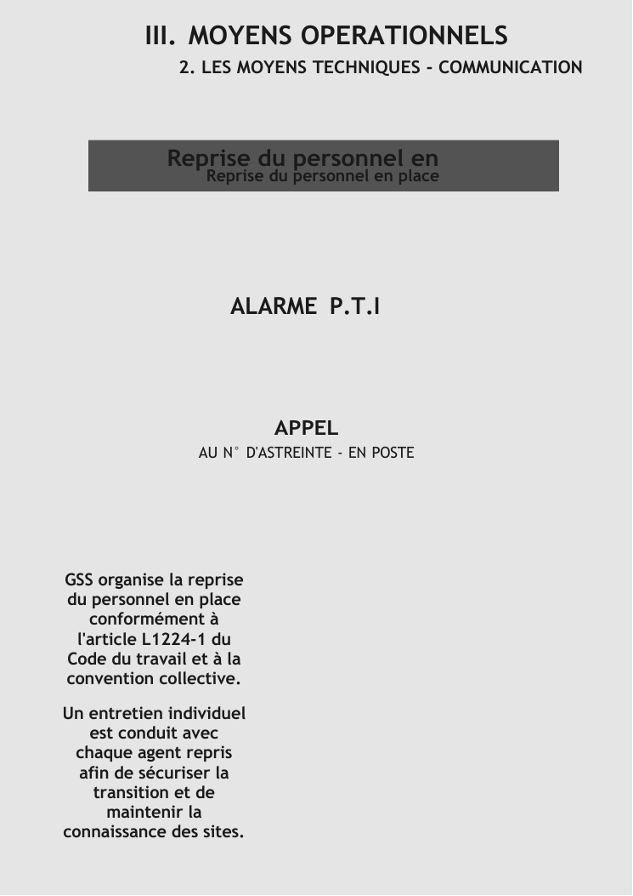
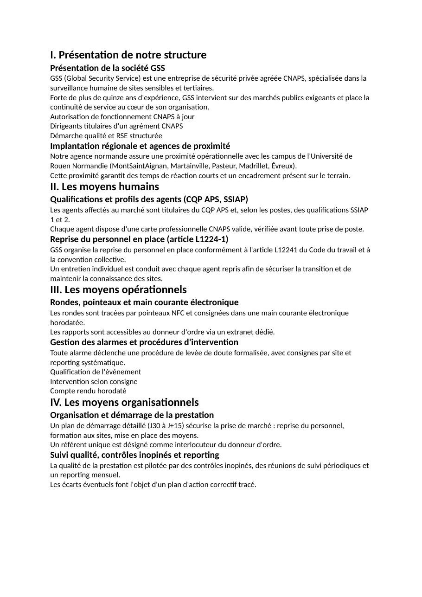

# V1 — Comparatif : template refondu vs génération sans template

> Phase 4. Deux DOCX produits à partir du **même contenu** (cas Université de Rouen
> Normandie), pour isoler l'apport réel du template.
> Sources (gitignorées) : `data/output/v1_with_template.docx` (Mode A, template refondu,
> ~13,5 Mo) et `data/output/v1_no_template.docx` (Mode B, nu, ~2,5 Ko).

## Captures

| Couverture maître (préservée) | Page dupliquée refondue (fond gris) | Sans template (nu) |
|---|---|---|
|  |  |  |

## Grille de comparaison

| Élément | Mode A (template refondu) | Mode B (sans template) |
|---|---|---|
| Page de garde (titre, bandeau, image entête) | ✅ couverture maître intacte (bandeau GSS, visuels) | ❌ absente — démarre au chapitre I |
| En-tête répétitif | ✅ bandeau / zone de titre du maître sur chaque page-modèle | ❌ aucun |
| Pied de page | ✅ hérité du maître | ❌ aucun |
| Numérotation des pages | ⚠️ selon le maître | ❌ aucune |
| Hiérarchie typographique (H1/H2/H3) | ✅ titres maître (chapitre / section) | ⚠️ gras + 2 tailles, pas de styles Heading |
| Tableaux signalétiques | ⚠️ ceux du maître | ❌ aucun |
| Sommaire | ⚠️ celui du maître | ❌ aucun |
| Cohérence palette (gris uniforme) | ✅ fond gris `#E5E5E5` sur les pages dupliquées | ❌ blanc brut |
| Images de fond pages dupliquées | ✅ retirées (allégées) au profit du gris | n/a |
| Lisibilité du texte injecté | ✅ texte sombre sur gris | ⚠️ noir sur blanc, sans mise en forme |
| Police | ✅ Trebuchet MS (identité maître) | ⚠️ Calibri (défaut Word) |
| Poids du fichier | ~13,5 Mo (design maître préservé) | ~2,5 Ko |

## 1. Ce que le template apporte

1. **Une page de garde** complète (couverture maître : bandeau GSS, visuels, « MÉMOIRE TECHNIQUE »).
2. **Une identité visuelle de marque** répétée : bandeau / zone de titre sur chaque page-modèle.
3. **Une hiérarchie typographique lisible** (titres de chapitre / section stylés par le maître).
4. **Pied de page, polices, tableaux et sommaire** hérités du maître.
5. **Après refonte** : un **fond gris uniforme** cohérent sur les pages dupliquées (à la place des lourdes images de fond), avec **texte sombre lisible** et **titre conservé**.

## 2. Ce qui manque quand on génère sans template

1. **Aucune page de garde** : le document s'ouvre directement sur « I. … ».
2. **Aucune identité visuelle** : pas de bandeau, pas de logo, pas d'en-tête/pied.
3. **Aucune cohérence chromatique** : fond blanc, texte noir, zéro accent.
4. **Hiérarchie pauvre** : titres en gras de taille variable, pas de styles Heading → **pas de sommaire automatique**.
5. **Pas de pied de page / numérotation**.
6. **Police par défaut** (Calibri) au lieu de l'identité de marque.

### Top 3 carences (sans template)
1. **Page de garde + identité visuelle absentes** (impression non finie, non livrable).
2. **Hiérarchie typographique et styles Heading absents** (pas de sommaire, lisibilité faible).
3. **Pied de page / numérotation / cohérence chromatique absents**.

## 3. Recommandations pour combler les carences (génération sans template)

1. **Page de garde minimale** : générer un titre + client + date + signature GSS en tête du DOCX nu.
2. **Styles Heading réels** : injecter `word/styles.xml` (Heading1/2/3) + `<w:pStyle>` → hiérarchie native **et sommaire automatique** (`TOC`).
3. **Listes & mise en forme** : `word/numbering.xml` minimal pour de vraies puces/numéros.
4. **Pied de page + numérotation** : `footer1.xml` avec champ `PAGE`.
5. **En-tête léger** : petit bandeau/logo GSS + police de marque pour garder un minimum d'identité.

> Conclusion : le template n'apporte pas le « contenu » (identique dans les deux cas) mais
> toute la **mise en forme structurante** — page de garde, identité, hiérarchie, cohérence.
> La refonte V1 améliore les **pages dupliquées** (fond gris uniforme + retrait des images de
> fond + texte lisible) tout en **préservant** le design maître. Sans template, la sortie reste
> exploitable comme brouillon de contenu mais n'est pas livrable en l'état.
