<!-- _class: lead -->

# GLOBAL SECURITY SERVICES
## VOTRE PARTENAIRE SÉCURITÉ
### MÉMOIRE TECHNIQUE
#### <entreprise>

---
<!-- header: "" -->

GLOBAL SECURITY SERVICES

VOTRE PARTENAIRE SECURITE

MÉMOIRE TECHNIQUE

SECURITE INCENDIE - SURETE POUR  &lt;entreprise&gt;
---
**PRESENTATION DE NOTRE STRUCTURE****NOTRE CATALOGUE DE PRESTATION****ORGANIGRAMME****NOS VALEURS****NOTRE ENGAGEMENT ECOLOGIQUE****ILS NOUS ONT FAIT CONFIANCE****LES MOYENS HUMAINS****ADEQUATION DES MOYENS HUMAINS AVEC LE BESOIN****FORMATIONS ET QUALIFICATIONS****LES FORMATIONS ET CERTIFICATIONS****LES FORMATIONS INTERNES****NOTRE PROCEDURE DE RECRUTEMENT****NOS VALEURS MANAGERIALES****UN INTERLOCUTEUR UNIQUE****LES MOYENS OPERATIONNELS****LES TENUES****LES MOYENS TECHNIQUES****LA PLANNIFICATION****LA MAIN COURANTE****LE CONTRÔLEUR DE RONDES****LE LIVRE DES MISSIONS ET CONSIGNES****LA GESTION DES MOYENS D’ACCES**

**LES MOYENS ORGANISATIONNELS****LE SUIVI QUALITE****LE CONTROLE DES AGENTS ET DES PRESTATIONS****LE SUIVI DES CONTROLES****LE LOGICIEL DE CONTROLE****LE DOSSIER BILAN****LA PROCEDURE DE CONTROLE****L’EQUIPE DE CONTROLE AGENCE NORD OUEST****LES PROCEDURES OPERATIONNELLES****REMPLACEMENT D’UN AGENT ABSENT****INTEGRATION D’UN NOUVEAU MARCHE****MISE EN PLACE D’UNE PRESTATION****INTEGRATION D’UN NOUVEL AGENT****LE DISPOSITIF EVENEMENTIEL**
---
1. NOTRE CATALOGUE DE PRESTATIONS**	**

Zone d’image

NOS OFFRES SURMESURES

« Contexte sur mesure début »

.

« Contexte sur mesure fin »
---
1. NOTRE CATALOGUE DE PRESTATIONS**	**

Zone d’image

NOS OFFRES SURMESURES

« Contexte sur mesure »

« Contexte sur mesure fin »
---
1. NOTRE CATALOGUE DE PRESTATIONS**	**

Zone d’image

NOS OFFRES SURMESURES

« Contexte sur mesure »

« Contexte sur mesure fin »
---
1. NOTRE CATALOGUE DE PRESTATIONS**	**

Zone d’image

NOS OFFRES SURMESURES

« Contexte sur mesure »

« Contexte sur mesure fin »
---
1. NOTRE CATALOGUE DE PRESTATIONS**	**

Zone d’image

NOS AGENTS CYNOPHILES

Nos **agents cynophiles**, ou "maîtres-chiens", fonctionnent en tandem avec leur animal, et en maîtrisent leur dressage.

ils mettent leurs compétences et qualifications à votre service pour des missions de **sécurisation **des biens et des personnes

par le biais de présence et de contrôle, de **rondes **ou d'opération de **filtrage**.

L'atout principal de la présence du chien est de proposer un élément **dissuasif **supplémentaire.

NOS AGENTS DE SÛRETÉ

Nos **agents de sûreté**, qualifiés et expérimentés, mettent leur savoir- faire à votre disposition selon vos besoins

Qu'il s'agisse de rondes de surveillance, de contrôle d'accès, ou encore d'intervention, nos agents travailleront à mettre en application vos consignes.
---
1. NOTRE CATALOGUE DE PRESTATIONSZone d’image

NOS AGENTS INCENDIE SSIAP

Nos **agents de sécurité incendie**, sont des acteurs essentiels de la prévention des risques, ils disposent tous de la qualification SSIAP et sont formés à **prévenir **un incendie, à la **mise en sécurité **d'un bâtiment, et à **intervenir et s'organiser **en cas d'incendie.

Selon vos besoins, plusieurs profils d'agent-vous sont proposés:

le **SSIAP 1, **agent de sécurité incendieLE	**SSIAP	2**,	chef	d'équipe d'agents incendieLE **SSIAP 3, **chef de service en sécurité incendieNOS AGENTS RONDIERS

Nos agents "**rondiers / intervenants**" peuvent réaliser des **rondes de surveillance **de site, des rondes de contrôle, ou encore des **interventions sur alarme **et mise en sécurité suite à un incident.

Ils disposent d'un **équipement **bien particulier qui leur permet d'être réactifs, et en constante **communication **avec les équipes et les clients.

Ils sont formés à tout type de contexte afin de gérer au mieux l'imprévu !
---
1. NOTRE CATALOGUE DE PRESTATIONSZone d’image

NOS AGENTS D'ACCUEIL

Les agents d'accueil ont une place primordiale, celle du premier contact avec le client / visiteur.

Ils sont en quelque sorte la **vitrine **de l'entreprise, il est donc essentiel de mettre en avant certaine qualités comme le **dynamisme**, la capacité d'adaptation, et la **courtoisie.**

Ce poste nécessite une certaine **polyvalence**. ils sont en effet amenés à **accueillir **et **orienter **le public, mais aussi à effectuer certaines **tâches administratives**

Zone d’image

NOS EXPERTS QUALITÉ

Nous disposons d'experts qualité qui sont à même de **diagnostiquer **vos besoins en sécurité et vous conseiller la **solution sur mesure **qui vous conviendra le mieux .

Nos experts sont également là pour **contrôler les prestations **de nos agents de terrain et ainsi maintenir un haut niveau d'exigence.
---
NOTRE CATALOGUE DE PRESTATIONSZone d’image

NOS PREVENTEURS

Nous disposons d'experts qualité qui sont à même de **diagnostiquer **vos besoins en sécurité incendie et sureté et vous conseiller la **solution sur mesure **qui conviendra au mieux .

NOS ANIMATIONS

**Animation exercice Equipier de Première Intervention :**

Cette animation est très importante pour intervenir en sécurité face à une départ de feu dans l'entreprise. Cette intervention **rapide **et proportionné limitera l'impact pour l'entreprise et les salariés. Le maintien et l'**actualisation des compétences **est primordial pour garantir des équipiers **opérationnels**.

Gestion des prestatairesVeille réglementaireAnalyse des risques (sûreté et sécurité)-Rédaction des permis de travail

-Suivi de chantier

-Support HSE...

Zone d’image

**Animation exercice Equipier de Seconde Intervention :**

Cette animation permettra de garder un niveau de **compétence opérationnel**. Elle met en pratique les différentes procédures de protection des personnes et des installations. Elle peut être personnalisée selon vos procédures. Nos animateurs ESI sont issus d'un cycle de formation du CNPP.

**Animation Sauveteurs Secouriste au Travail :**

Les animations permettent aux personnes qualifiées SST ou PSC1 de garder une compétence opérationnelle accrue. Les mises en situations sont ciblées selon vos risques et la nature de votre activité.

**MARCHANI Adil**

**Directeur d'agence Responsable de marché**

**KANTE Rokia**

**Responsable RH**

**PORCHAIRE Laurent**

**Responsable d'exploitation**

**DA SILVA Luis**

**Responsable d’exploitation**

**VATTIER Marie**

**Responsable Qualité**

**ALAMAT Ramzi**

**Responsable Unité mobile**

**PODKOLZIN Sergeï**

**Responsable Cynophile**

**ATTOU NESRINE**

**Responsable Incendie**

**Equipe**

**I.**

**PRESENTATION**

**2. ORGANIGRAMME**

**Agents contrôleurs, rondiers**

**Equipe**

**Agents AMC, ADS**

**Equipe**

**Agents SSIAP**
---
3. NOS VALEURSNous avons trois mots d’ordres qui sont le fondement de notre façon de travailler et de nos aspirations de qualité, nous basons toutes nos démarches professionnelles en nous efforçant toujours d’être en adéquation avec ces valeurs :

ECOUTE : l’écoute est primordiale dans le secteur du service, elle permet de s’approcher au maximum du besoin de son client, mais aussi dans le management de ses équipes, faire preuve d’écoute va permette de pérenniser ses équipes et d’être au plus près de leur besoins, difficultés et projets.RESPECT : La sécurité est un métier de contact, afin de faciliter au maximum les échanges, le respect envers ses interlocuteurs est fondamental ; cette valeur fait partie intégrante du secteur de la sécurité, on attend d’un agent le respect des procédures et des institutions.FLEXIBILITE : n’oublions pas que la sécurité est un service, nous nous devons de mettre en œuvre notre maximum afin de répondre à vos besoins, cela est souvent synonyme de réactivité et de flexibilité.
---
4. NOTRE ENGAGEMENT ECOLOGIQUENous avons conscience qu'aujourd'hui, le climat et le respect de la nature est un enjeu primordiale. Il est essentiel de changer nos habitudes et tendre vers un impact minimale; cette démarche n'est pas incompatible avec l'activité professionnelle bien au contraire, à notre échelle, nous avons mis en place des actions concrètes au sein de notre fonctionnement d'entreprise.

Les transports

Nous encourageons nos employés, lorsque la nature de leur vacation le leur permets, de se rendre en transports en commun ou en vélo sur leur site.

Lors d'évènements où plusieurs agents se rendent sur le même site, nous organisons systématiquement des départs du bureau en covoiturage afin de réduire le nombre de véhicules mobilisés.

Nos rondiers contrôleurs sont amenés à beaucoup utiliser leurs véhicules de fonction, de par la nature de leurs mission, qui est de se déplacer sur tous les sites. Nous budgétisons pour, à terme, remplacer notre flotte de véhicules par une flotte 100% électrique.

Nous avons réorganisé nos modes de travail, en optimisant les plages de travail en présentiel, et en favorisant le télétravail, ce qui réduit considérablement les trajets de nos collaborateurs "sédentaires" (l'équipe administrative principalement).
---
4. NOTRE ENGAGEMENT ECOLOGIQUEDans la même démarche, nous organisons de plus en plus nos réunion internes ou clientèles par visio-conférences, là aussi dans le but de réduire les trajets en voiture.

L'utilisation numérique

Nous essayons de rendre notre utilisation numérique plus écoresponsable par plusieurs actions.

Tout d'abord, nous utilisons un moteur de recherche particulier: ECOSIA, ce moteur de recherche reverse 80 % de ses gains publicitaire à des programmes de reforestation notamment au Brésil, en Indonésie et au Burkina Faso. Concrètement, un arbre est planté toutes les 45 recherches, il est ainsi possible de mesurer sa propre contribution.

Ensuite, nous essayons, tant que possible de se rapprocher du 0 papier. Nous avons déjà remplacé nos mains courantes format papier, par des mains courantes électroniques. Nous communiquons désormais essentiellement par mail ou par Dropbox en interne et n'imprimons plus de documents papiers.

Tous nos collaborateurs sont sensibilisés à trier régulièrement leur boîte mail. En effet, la surcharge de nos données sauvegardées électroniquement peut être très néfaste pour l'environnement. Nous ne gardons que ce qui est nécessaire.
---
4. NOTRE ENGAGEMENT ECOLOGIQUE Les économies d'énergie

D'abord, nous veillons à ce que certaines bonnes pratiques soient respectées dans nos locaux:

Bien éteindre les lumières, ordinateurs et chauffage le soir avant de quitter les bureauxNe	pas	allumer	les	lumières	des	bureaux	la	journée,	s'ils	sont suffisamment éclairés par la lumière naturelle.Bien fermer les robinets pendant que l'on se savonne les mainsUtiliser des piles rechargeables pour les lampes torches, etc...Nous veillons à entretenir régulièrement nos véhiculesNous avons remplacé les ampoules électriques classiques par des ampoules basses consommation.	Un réel engagement

Au delà des gestes du quotidien, plus globalement, nous donnons une dimension particulière à l'écologie dans notre approche de notre activité au sein de la société. Nous avons tous un rôle à jouer.

Pour nous, cela passe par exemple par le choix de nos partenaires et de nos fournisseurs, nous allons être attentifs à leurs propre sensibilité écologique.

Nous avons également à coeur de sensibiliser nos collaborateurs, c'est peut être en adoptant les bons gestes sur son lieu de travail, que l'on pourra plus facilement les adopter sur son lieu de vie.
---
4. NOTRE ENGAGEMENT ECOLOGIQUE	Le recyclage

Le matériel que nous mettons à disposition de nos agent à une durée de vie limitée, en effet, nous veillons à ce que leurs tenues soient régulièrement changée dans un soucis de présentation irréprochable.

Cependant, les vêtements dits “professionnels” sont plus difficiles à recycler que des vêtements classiques de par leurs spécificités techniques. Ils sont souvent floqués avec un logo d’entreprise, ou sont composés de différentes matières combinées rendant leur recyclage plus compliqué.

Nous avons trouvé un partenariat très novateur en la matière avec l’entreprise Triethic. En effet cette société propose une collecte de tenues professionnelle usagée, et un recyclage sous trois schémas différents:

Le réemploi : après avoir retiré les broderie (logo) et toute identification professionnelle de l’objet et sa remise en état, il est réemployé

L’effilochage: Les vêtements vont être triés par couleurs et matière avant d’être effilochés et retissés.

Combustible: les matières non réutilisables et non dangereuses vont être utilisées comme combustible (en vue de réduire la consommation d’énergies fossiles et de réduire l’enfouissement de déchets)
---
NOTRE ENGAGEMENT ECOLOGIQUENous avons organisé dans nos locaux un espace de tri sélectif avec les différentes poubelles, où tous les collaborateurs peuvent trier leurs déchets correctement et facilement.

Ensuite, nous avons considérablement réduit notre utilisation de papier, pour les documents imprimés qui se sont plus utilisés, nous les réutilisons comme papier brouillon.

Nous avons également un bac à compost pour y collecter tous les déchets alimentaires.

Enfin, pour la pause café, nous utilisons des capsules de café recyclables, et issues du commerce équitable. Chaque collaborateur utilise sa propre tasse pour ne pas utiliser de gobelet plastique ou carton à usage unique.

Enfin, nous veillons à ce que notre matériel électronique non utilisé, se voit offrir une deuxième vie, nous les donnons à des associations de recyclage et de réparation.

A l’heure où les questions écologiques sont centrales et où nous avons tous un rôle à jouer, il nous tient très à cœur de valoriser les actions menées au sein de notre structure par nos collaborateurs mais aussi de maîtriser les circuits dans lesquels nos déchets vont être dirigés.
---
ILS NOUS ONT FAIT CONFIANCEZone d’image

Ici nous allons vous présenter une partie des enseignes qui nous ont fait, et nous font confiance, en nous confiant la sécurité de leurs sites.

Il est intéressant de vous présenter ces sites et les expériences que nous avons pû y acquérir.

Nous n'avons sélectionné qu'un certain nombre de références par secteur d'activité.

Nous avons répertorié les différents secteurs d'activité suivants et allons y décrire les "missions types" d'un site en particulier.
---
<!-- header: "I. PRESENTATION" -->

**LA DISTRIBUTION**

Dans le secteur de la distribution, nous travaillons régulièrement avec différentes enseignes comme Carrefour, Leclerc, Intermarché, Intersport, Districenter, But, Noz, ou encore Kiloutou. La distribution est un secteur bien particulier et très complet en terme d'exigence de compétences (contact clientèle, équipes de vente, gestion des flux). L'agent de sécurité fait le lien entre toutes les zones. Il se doit de posséder un grand sens de l'observation et de concentration, tout en faisant preuve de dissuasion de façon mesurée pour rester dans une démarche commerciale.

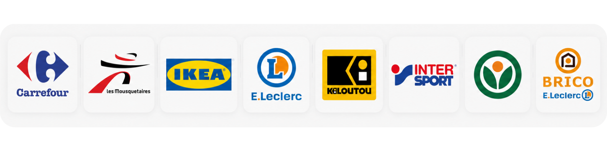
---
<!-- header: "PRESENTATION" -->

### SITE : CARREFOUR - VENETTE

  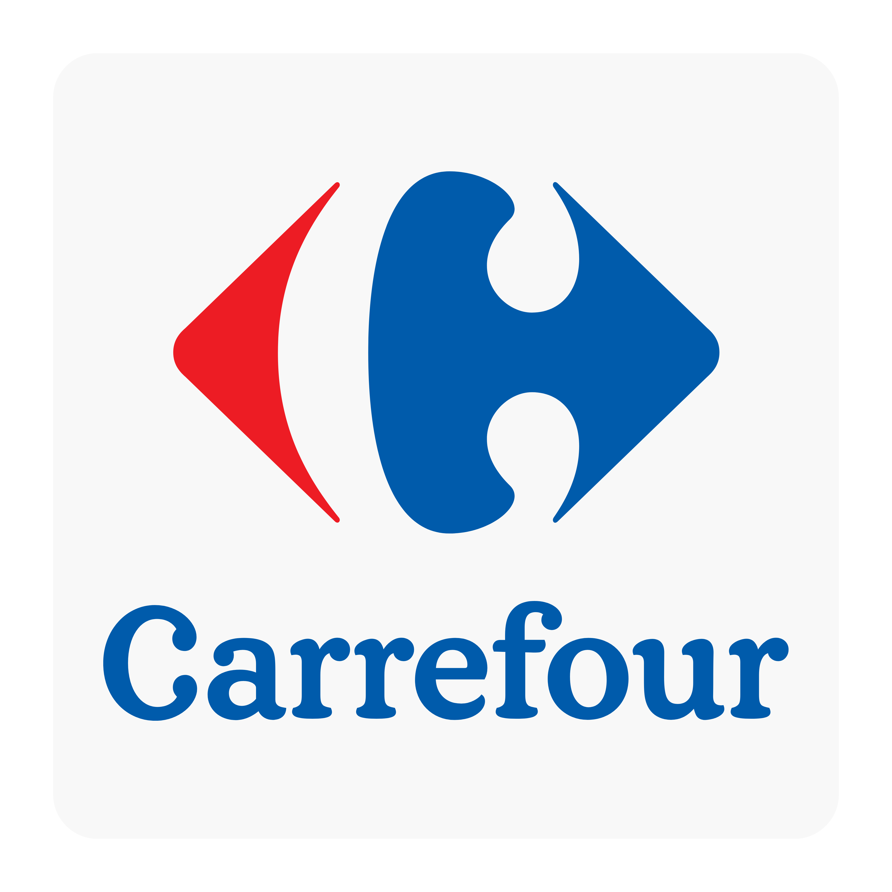
  

    <strong>SITUATION GÉOGRAPHIQUE :</strong> 6 avenue de l’Europe 60280
    <strong>EFFECTIF :</strong> 13 agents
    <strong>COMPÉTENCES :</strong> Télésurveillance, Vidéosurveillance, Sécurité incendie, Gardiennage et sûreté
  

Nous allons vous présenter dans les grandes lignes nos missions sur un de nos sites Carrefour.

**Nos missions :**
* Prévenir et empêcher le vol de marchandises
* Escorter les caisses lors des changements
* Rondes d'ouverture et de fermeture
* Vidéosurveillance du magasin
* Gestion et orientation des entrées public
* Gestion des livraisons fournisseurs et réception des camions
* Contrôle des installations incendie
* Surveillance nocturne des zones de parking
* Installation des systèmes antivols sur les articles onéreux
* Réarmement de la centrale de lavage en cas de panne
* Veiller au respect des consignes de sécurité
* Réaliser les relevés nocturnes de température du matériel de froid

Nous donnons une vraie consistance et un suivi aux missions de nos agents en proposant une remontée d'indicateurs (suivi chiffré et analysé : nombre d'interpellations, de vols, de rondes effectuées, d'incidents de température, etc.). Ces analyses nous permettent de faire évoluer notre prestation en synergie avec le client.
---
<!-- header: "ILS NOUS FONT CONFIANCE" -->

**LES MAIRIES**

Les prestations qui nous sont confiées par les mairies sont de deux natures: la surveillance des bâtiments municipaux et d'autre part la gestion de la sécurité évènementielle.

Notre équipe encadrante crée des liens étroits avec les équipes des communes avec lesquelles nous travaillons. En effet, pour la partie évènementielle, il est important de bien cerner les attentes de nos partenaires afin d'y répondre de façon pertinente.

En travaillant régulièrement ensemble, nous connaissons bien les prérogatives des communes et pouvons également les orienter sur les nouveautés en matière de sécurité (comme récemment avec les nouvelles dispositions en matière de lutte contre le Covid). Nous travaillons vraiment en synergie pour réaliser une prestation de qualité.

Pour ce qui est de la surveillance des bâtiments municipaux, il est important pour nous de mettre en place une équipe pérenne, qui va avoir une parfaite connaissance des lieux et des équipes techniques de la mairie afin de pouvoir réaliser à la fois une surveillance pointue des installations incendie, mais aussi de pouvoir être très réactif lors d'une intervention sur alarme

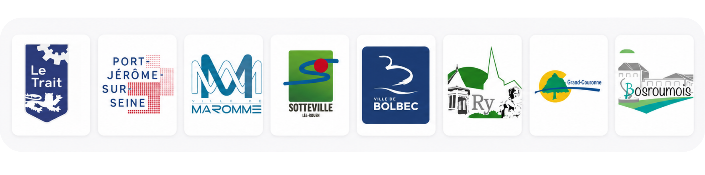
---
<!-- header: "ILS NOUS FONT CONFIANCE" -->

### SITE : CINÉMA - THÉÂTRE - BÂTIMENTS COMMUNAUX

  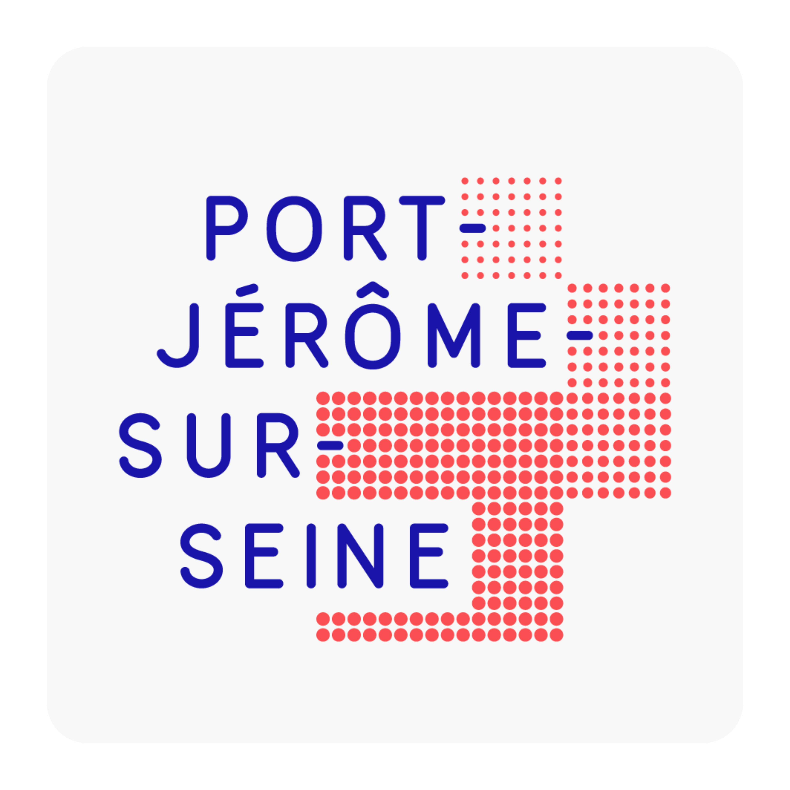
  

    <strong>SITUATION GÉOGRAPHIQUE :</strong> Port-Jérôme-sur-Seine 76330
    <strong>EFFECTIF :</strong> 2 à 30 agents
    <strong>COMPÉTENCES :</strong> Sécurité événementielle, Surveillance de bâtiments, Sécurité incendie
  

Nous allons vous présenter dans les grandes lignes nos missions chez une de nos mairies partenaires : la ville de Port Jérôme sur Seine.

**Nos missions Cinéma et spectacles :**
* Filtrer les entrées du cinéma et de la salle de spectacle
* Réaliser des rondes de surveillance pendant les séances et spectacles
* Réaliser des rondes de surveillance incendie pendant les séances et spectacles
* Veiller au respect des gestes barrières

**Nos missions événementielles :**
* Filtrer et compter les entrées et sorties lors d'événements de la commune
* Organiser la surveillance de sûreté et sécurité pendant les événements
* Réaliser des rondes de contrôle d'installations de sécurité incendie
* Réaliser des rondes de surveillance des installations événementielles lors de la fermeture au public et veiller à la non-dégradation du matériel
* Veiller au respect des gestes barrières

**Nos missions surveillance de bâtiments :**
* Effectuer des interventions sur alarme lorsqu'une alarme d'un bâtiment municipal se déclenche
* Effectuer régulièrement des rondes de vérification du matériel incendie et du matériel d'alerte.
---
<!-- header: "ILS NOUS FONT CONFIANCE" -->

**LES SITES INDUSTRIELS**

Différentes structures industrielles nous ont fait confiance en nous confiant leurs besoins en sécurité.

Ce secteur d'activité est bien particulier et très intéressant de par sa diversité. Chaque site va présenter des besoins différents, selon sa configuration, selon sa nature d'activité, ou encore selon sa production.

Notre rôle est de se tenir toujours à la pointe des normes de sécurité dans ce domaine et de tenir nos équipes en perpétuelle formation.

Nos équipes sur place se doivent de faire preuve d'une grande rigueur et de discrétion.

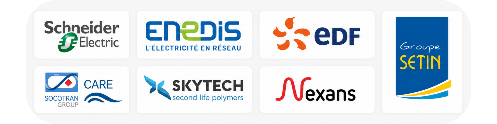
---
<!-- header: "ILS NOUS FONT CONFIANCE" -->

### SITE : SCHNEIDER ELECTRIC

  
  

    <strong>SITUATION GÉOGRAPHIQUE :</strong> Beaumont le Roger 27170
    <strong>EFFECTIF :</strong> 8 agents
    <strong>COMPÉTENCES :</strong> Sécurité industrielle, Surveillance, Sûreté, Sécurité incendie, Prévention des risques
  

Nous allons vous présenter dans les grandes lignes nos missions chez un de nos partenaires industriels :

**Nos missions :**
* Sécurisation du site
* Réalisation de rondes de surveillance
* Filtrage des entrées et sorties
* Gestion des moyens d'accès
* Gestion des accès livraison
* Gestion des accès aux entreprises externes intervenantes
* Intervention sur alarme
* Vérification des installations électriques
* Mission de prévention des risques
* Formation SST et Pompier auprès des salariés du site.
---
<!-- header: "ILS NOUS FONT CONFIANCE" -->

**LES ECOLES, UNIVERSITES ET FACULTES**

Nous sommes régulièrement sollicités pour effectuer des missions de sécurité au sein d'établissement scolaires ou d'enseignement et formation professionnelles, comme par exemple au CESI, NEOMA Business School, l'université Olympe de Gouges à Alençon ou encore pour l'université de Rouen.

Là encore, ces missions sont de natures très différentes. Il peut s'agir de surveillance humaine dans des locaux de type collège ou lycée, en cas de système d'alarme défaillant ou suite à des dégradations. Mais aussi de partenariats plus ancrés, au sein duquel nous effectuons des missions d'accueil, de prévention, et de gestion humaine.

Ici, nos agents sont formés à être en interaction avec le personnel enseignant et une population étudiante. Ils doivent mettre l'accent sur la communication avec une certaine fermeté. Ils doivent également faire preuve de polyvalence et d'adaptabilité.

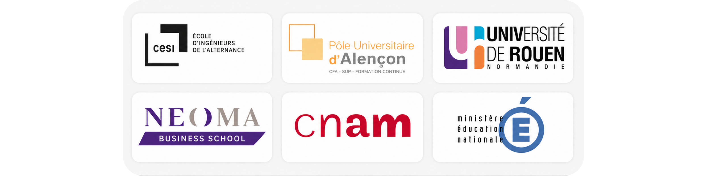
---
<!-- header: "ILS NOUS FONT CONFIANCE" -->

### SITE : CESI - CAMPUS D'ENSEIGNEMENT SUPÉRIEUR

  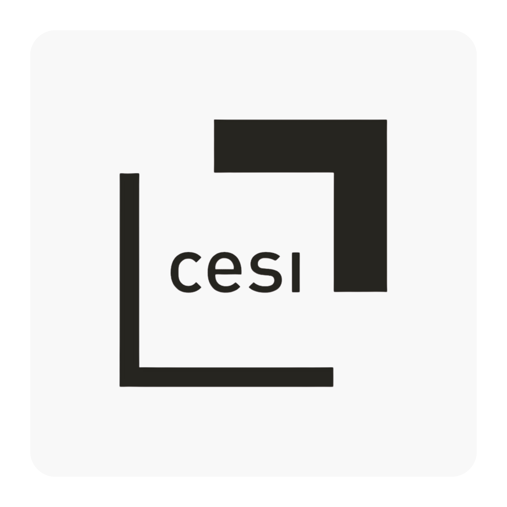
  

    <strong>SITUATION GÉOGRAPHIQUE :</strong> Rouen, Caen, Lille
    <strong>COMPÉTENCES :</strong> Surveillance & Sûreté, Accueil & Orientation, Sécurité incendie
  

Nous allons vous présenter dans les grandes lignes nos missions chez un de nos partenaires d'enseignement supérieur :

**Nos missions :**
* Accueil des étudiants et des intervenants externes
* Accueil des entreprises externes et réception des commandes
* Gestion du pôle accueil et prêt de matériel informatique aux étudiants
* Mise en place des badges et création des accès
* Gestion de la circulation sur la zone de parking de l'établissement
* Gestion du courrier et des colis à l'accueil
* Renseigner et orienter les intervenants
* Rondes de vérification du respect du règlement intérieur
* Accompagnement sur les exercices d'évacuation incendie
* Rondes de vérification du matériel incendie
* Gestion de la sécurité des événements du campus (portes ouvertes, fêtes étudiantes, remises de diplômes...)
* Participation et intervention dans un processus d'amélioration de la sécurité
* Intervention sur alarme
---
<!-- header: "ILS NOUS FONT CONFIANCE" -->

**LES ETABLISSEMENTS BANCAIRES**

Nous sommes régulièrement sollicités pour effectuer des missions de sécurité au sein d'établissement bancaires.

Il peut s'agir de sécuriser une agence pendant les plages horaires d'ouverture ou encore de sécuriser l'agence pendant des interventions d'entreprises extérieurs.

Les agents en place doivent faire preuve d'une bonne communication comme pour tout site accueillant du public, ainsi que le respect des procédures internes du groupe bancaire.

---
<!-- header: "ILS NOUS FONT CONFIANCE" -->

### SITE : AGENCE CIC

  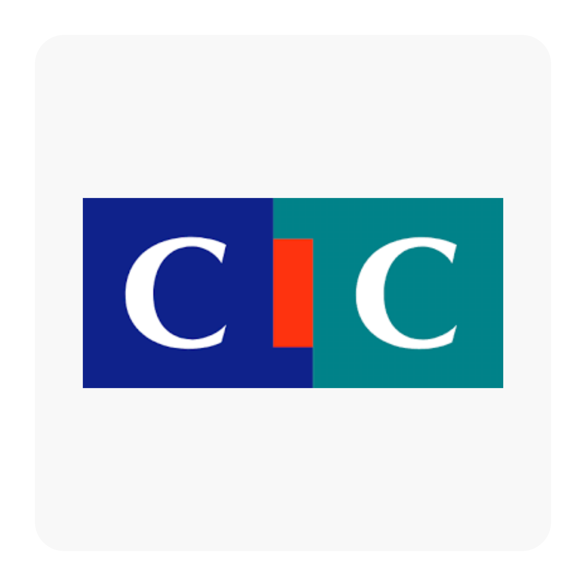
  

    <strong>SITUATION GÉOGRAPHIQUE :</strong> Amiens 80000
    <strong>EFFECTIF :</strong> 2 agents
    <strong>COMPÉTENCES :</strong> Sécurité incendie, Gardiennage et sûreté, Vidéosurveillance
  

Nous allons vous présenter dans les grandes lignes nos missions chez un de nos partenaires bancaires :

**Nos missions :**
* Vérification du respect des gestes barrières
* Rondes de vérification du matériel incendie
* Intervention sur alarme
* Sécurisation de l'agence
* Accueil des entreprises intervenantes pendant les travaux
* Intervention sur alarme
---
<!-- header: "ILS NOUS FONT CONFIANCE" -->

**LES INSTITUTIONNELS**

Nous accompagnons depuis plusieurs années, différents acteurs institutionnels de notre territoire comme la CAF, la chambre des métiers et de l’artisanat et la région Normandie.

Travailler à leurs côtés nous a permis d’enrichir notre savoir-faire et savoir être, nos procédures et d’être en capacité de pouvoir intervenir avec pertinence sur un siège social.

En effet, sur ce type de site, la représentation, la posture et les compétences doivent être particulièrement accrue et visibles.

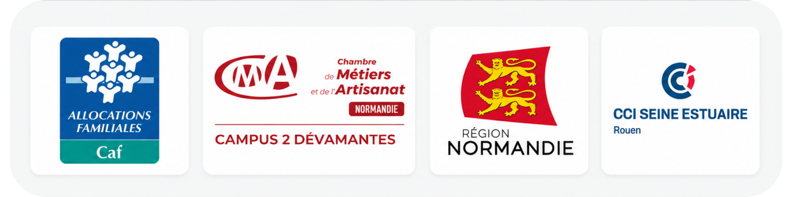
---
<!-- header: "ILS NOUS FONT CONFIANCE" -->

### SITE : SIÈGE DE LA RÉGION NORMANDIE

  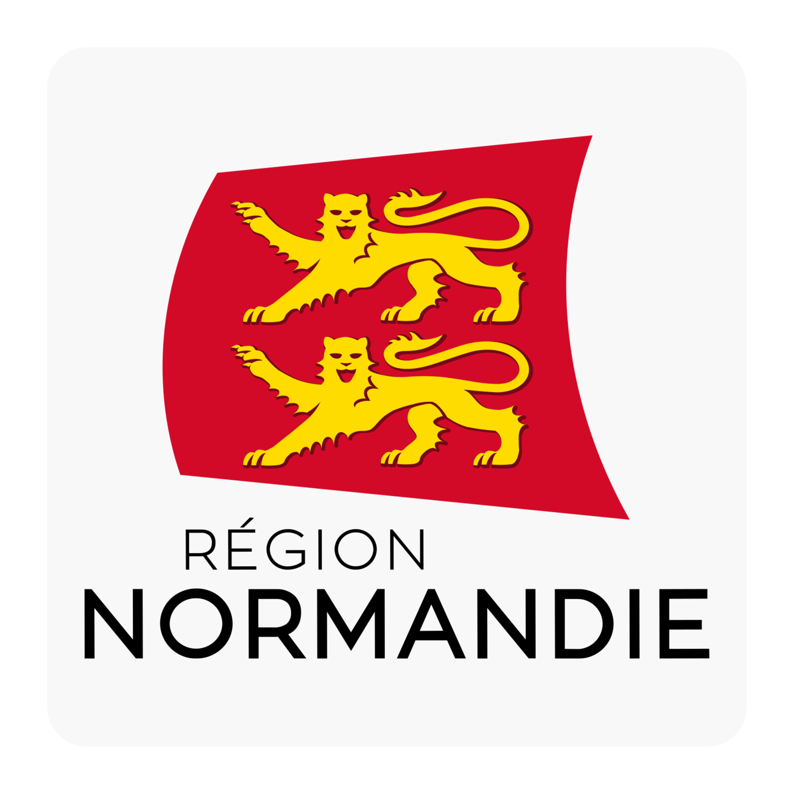
  

    <strong>SITUATION GÉOGRAPHIQUE :</strong> Abbaye aux Dames 14000 CAEN
    <strong>EFFECTIF :</strong> 20 agents
    <strong>COMPÉTENCES :</strong> Surveillance & Sûreté, Sécurité Incendie, Accueil & Filtrage
  

Nous avons la chance d’accompagner la région Normandie, à la fois pour sécuriser les sièges de Rouen et de Caen, mais aussi pour sécuriser les différents établissements scolaires placés sous la responsabilité de la Région, lors de différents disfonctionnements.

**Nos missions :**
* Gardiennage des bâtiments administratifs et des lycées
* Rondes de sécurité incendie et SSIAP dans les internats de la région
* Vérification des installations et matériels incendie
* Rondes de surveillance et vérification des accès / issues de secours
* Accompagnement des différents intervenants travaux
* Lever de doutes en cas d’alarme
* Accueil, filtrage et orientation du public
* Secours à la personne
* Renfort et gestion de la sécurité de différents évènements ponctuels
---
<!-- header: "ILS NOUS FONT CONFIANCE" -->

**LES SITES ET EVENEMENTS SPORTIFS**

Nous intervenons également dans le milieu sportif, à travers des partenariats réguliers comme le QRM, un club de football local ; mais aussi sur sollicitation pour des évènements sportifs ponctuels, comme par exemple, le marathon 76 ou encore le tour de France.

Ces missions nous permettent de mettre en œuvre nos capacité de mobiliser nos équipes en nombre pour un évènement ponctuel, l’organisation de ces derniers, ainsi que notre capacité d’adaptation.

---
<!-- header: "ILS NOUS FONT CONFIANCE" -->

### SITE : QUEVILLY ROUEN METROPOLE

  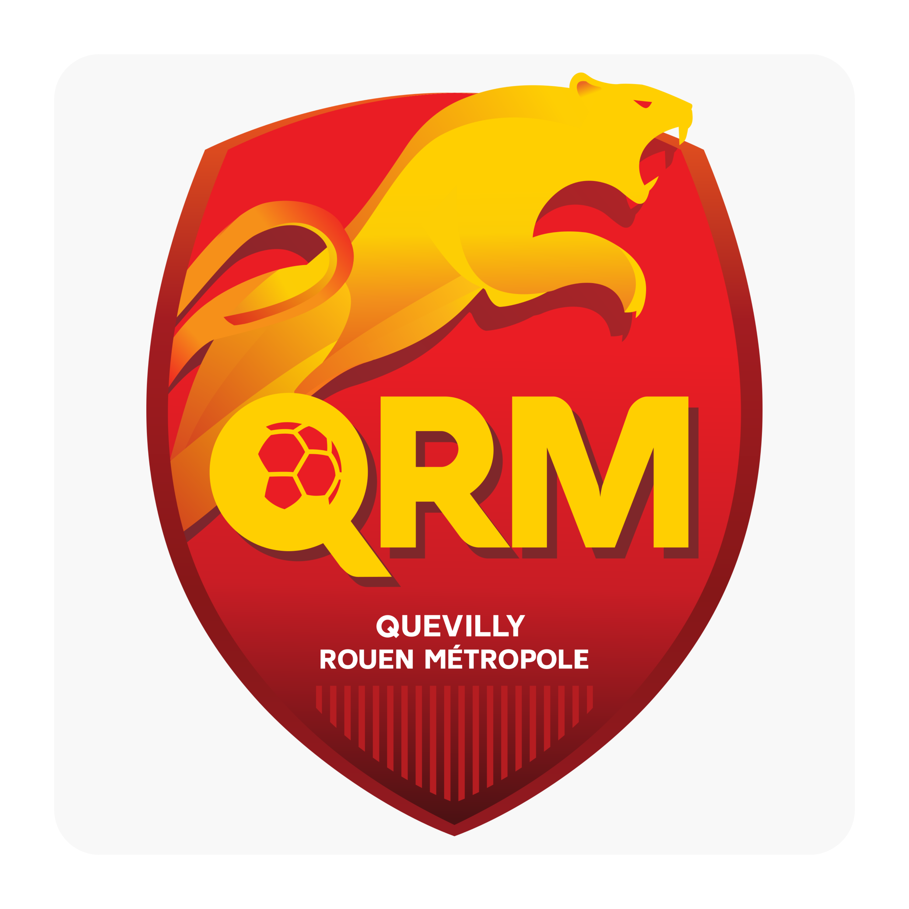
  

    <strong>SITUATION GÉOGRAPHIQUE :</strong> Rouen Stade Diochon
    <strong>EFFECTIF :</strong> 40 agents
    <strong>COMPÉTENCES :</strong> Sécurité événementielle, Sûreté, Sécurité Incendie (SSI)
  

Nous allons vous présenter dans les grandes lignes nos missions chez un partenaire organisateur d’évènements sportifs : le QRM, où nous allons pouvoir gérer tout type d’évènements et de prestation sûreté et sécurité.

**Nos missions :**
* Rondes de sûreté dans les diverses zones du site
* Rondes de sécurité incendie, gestion et suivi du SSI
* Gestion des moyens d'accès et sécurisation des accès
* Filtrage du public, renfort du personnel d'accueil et orientation du public
---
<!-- header: "LES MOYENS HUMAINS" -->

Catégorie de personnel

AGENT DE SECURITE SSIAP 1

SSIAP 2

SSIAP 3

CONTRÔLEUR AGENT CYNOPHILE

RESPONSABLE QUALITE

RESPONSABLE EXPLOITATION COORDINATEUR SECURITE

RESSOURCE HUMAINE COMPTABLE

RESPONSABLE RSE

Qualification

CQP

SSIAP 1

SSIAP 1 -SSIAP 2

SSIAP 1 - 2 - 3 MANAGER

CQP - CQP CYNO LICENCE

CQP - SSIAP1

CQP - SSIAP 1 - 2 - 3 MASTER RH

BP COMPTABILITE

MASTER RH

Nombre

423

185

28

2

35

27

1

5

5

4

2

2

**II. LES MOYENS HUMAINS**

1. **ADEQUATION DES MOYENS HUMAINS AVEC LE BESOIN**

**Informations relatives à l'armement****II. MOYENS HUMAINS**

**2. FORMATIONS ET CERTIFICATIONS**

**AGENT DE SECURITE - ADS**

Nos agents sont formés à la classification d’armes, leur définition et destination, aux conditions d’armement, de port d’armes et de transport d’armes ; ainsi qu’aux règles relatives à leur acquisition et détention.

**Palpation de sécurité**

Une palpation de sécurité est une mesure de sureté destinée à s’assurer qu’une personne ne porte pas sur elles d’objets dangereux pour elle-même ou autrui. Elle consiste à appliquer les mains par-dessus les vêtements et les accessoires portés (parapluie, coiffe, gants, ...) d’une personne afin de déceler la présence de tout objet susceptible d’être dangereux. La palpation de sécurité doit toujours être effectuée par une personne de même sexe que celle qui en fait l’objet. Nos agents ont reçu une formation complémentaire au diplôme CqP concernant ce point spécifique.

**Contrôle des effets personnels**Nos agents de sécurité sont formés au contrôle des effets personnels, ce contrôle se limite à une vérification visuelle des effets personnels (sacs à mains, sacs à dos,…)

**Accueil et contrôle d’accès**Nos agents ont acquis le savoir-faire attenant au contrôle d’accès, c’est- à-dire être capable de définir le domaine de celui-ci, de savoir contrôler les parkings, sites publics et privés mais aussi d’être à même de filtrer des véhicules.
---
FORMATIONS ET CERTIFICATIONS**AGENT DE SECURITE - ADS**

**Analyse de comportements et gestion des conflits**Le savoir-faire de nos agents réside en trois points :

Repérer et analyser un comportement conflictuel, déterminer les origines et le type de conflit dont il s’agitMettre en place des outils pour résoudre ce conflit ; être capable de traiter une agression verbale, de gérer les émotions des acteurs du conflit, et de maitriser les techniques verbales, postures et gestuelles adaptées.Mettre en place ces outils afin de prévenir un conflit.**Informations relatives à l’incendie**Nos agents sont formés à analyser un feu (causes, effets, classes et propagation), ils sont également familiarisés aux systèmes de détection automatique et tableaux de signalisation incendie.

Nos agents sont également familiarisés avec les dispositifs d’extinction ainsi qu’avec le processus d’acquittement d’une alarme restreinte.

**Secourisme à personnes**Nos agents sont formés aux premiers secours, c’est-à-dire protéger, examiner, alerter ou faire alerter, secourir ; les gestes de premiers secours.
---
2. FORMATIONS ET CERTIFICATIONS

**SSIAP 1**

Global Sécurité Services, disposons au sein de notre équipe d'agents de sécurité SSIAP 1 (service de sécurité incendie et assistance à personnes), ils sont formés aux concepts suivants :

**Le feu et ses conséquences**Nos agents qualifiés SSIAP1 maitrisent plusieurs concepts attenants au feu : la propagation, le comportement au feu des produits et matériaux, les différentes classes de feu, le triangle de feux qui théorise le fonctionnement d’un feu, la fumée et ses dangers ainsi que les agents extincteurs qui existent.

**La sécurité incendie**Nos agents qualifiés SSIAP1 maitrisent plusieurs concepts attenants au feu : la propagation, le comportement au feu des produits et matériaux, les différentes classes de feu, le triangle de feux qui théorise le fonctionnement d’un feu, la fumée et ses dangers ainsi que les agents extincteurs qui existent.
---
2. FORMATIONS ET CERTIFICATIONS

**SSIAP 1**

Nos agents SSIAP1 sont à même de classifier les établissements en diverses catégories (ERP établissements recevant du public, IGH immeuble de grande hauteur, …) et connaissent leurs fondamentaux de sécurité

Ils sont également formés à la desserte des bâtiments, c’est-à-dire, l’isolation du voisinage, les façades accessibles, les voies d’engins et voies d’échelles.

Le cloisonnement d’isolation des risques est une autre compétence du SSIAP1, il connait les différents types de cloisonnement (traditionnel, par secteur, ou par compartimentage) ainsi que sur l’évacuation du public, la gestion de l’évacuation, les différentes voies d’évacuation et les dispositions particulières en matière d’évacuation (ex : évacuation de personnes handicapées).

En matière de désenfumage, nos agents sont capables de gérer un dispositif de déclenchement de désenfumage ainsi que son entretien, et ont connaissance des dispositifs de désenfumage mécanique ou naturel.
---
2. FORMATIONS ET CERTIFICATIONS

**SSIAP 1**

Nos agents SSIAP1 sont formés aux différents moyens de secours : Tout d’abord les moyens d’extinction : les RIA (robinets incendie armés), les déversoirs ponctuels (surtout utilisés dans les ERP particuliers), les éléments de construction irrigués (validés par une commission de sécurité), les BI et PI ou les bouches incendie et poteaux incendie, les colonnes sèches ou en charge, les installations d’extinction automatique, les appareils mobiles type extincteur, et toute autre moyen de secours (réserve de sable, couvertures,…)

Ensuite, les moyens visant à faciliter l’action des sapeurs-pompiers comme l’affichage du plan de l’établissement schématisé ; comme un espace d’attente sécurisé ; un dispositif et commande de sécurité, ou encore un organe de coupure de source d’énergie.
---
2. FORMATIONS ET CERTIFICATIONS

**SSIAP 1**

Mais encore au système de sécurité incendie (SSI), comprenant le système d’alarme, le système de mise en sécurité incendie, et le système de détection incendie.

Et enfin, au système d’alerte, c’est-à-dire tout dispositif qui permet l’alerte de façon efficace comme une ligne téléphonique reliée directement aux services de sapeurs-pompiers, un avertisseur d’incendie privé ou autre.

**Les installations techniques**Tout d’abord, le risque électrique est l’une des causes principales d’incendies dans les établissements recevant du public, les installations électriques sont donc un point important sur lequel nos agents sont formés.

Les objectifs de sécurité à ce niveau sont de maintenir le fonctionnement de l’alimentation des installations de sécurité ainsi que d’éviter que les installations électriques ne présentent des risques d’éclosion et de propagation de l’incendie.

Dans ce sens, nos agents sont formés :

Au maintien de l’alimentation des installations de sécuritéA l’évacuation en cas de défaillanceAux dispositifs de coupure d’urgenceAux différents types de sources électriques (groupe électrogène, batterie d’accumulateurs) et leurs normes de sécuritéLes conducteurs électriquesAux vérifications techniques des installations électriques
---
2. FORMATIONS ET CERTIFICATIONS

**SSIAP 1**

Nos agents de sécurité SSIAP1 doivent être capables de définir les différents types d’appareils élévateurs : ascenseurs, nacelles, monte- charge, escaliers mécaniques. Ils doivent connaitre les dispositifs de secours et les dispositifs particuliers pour les personnes handicapés.

Les IFEA (Les installations fixes d’extinction automatique) sont des réseaux de canalisations situés dans des zones dites à risques ou lorsque les obligations règlementaires l’exigent. Ce système a pour vocation de détecter l’incendie, de déclencher le système d’alerte et d’éteindre, ou de contenir l’incendie. Les agents sont formés à leur principe de fonctionnement, leurs éléments constitutifs comme les « têtes de sprinkler », les différents types d’IFEA, et enfin à leur vérification et entretien.

Deux autres installations techniques sont étudiées, il s’agit des colonnes « sèches » et des colonnes « humides ».

Les colonnes sèches sont alimentées par les sapeurs-pompiers à leur arrivée avec des bouchons d’alimentation à chaque étage, et les colonnes humides sont en permanence chargées en eau (elles ne sont nécessaires que dans certains bâtiments classés ERP particuliers ou dans les IGH par exemple. Les agents GSS SSIAP1 sont au fait des particularités de chacune, des vérifications qui incombent au responsable du bâtiment, aux organismes spécialisés, et à lui-même.
---
2. FORMATIONS ET CERTIFICATIONS

**SSIAP 1**

La vérification visuelle, décomposée comme ce qui suit :

La présence du bouchon de fermeture et de sa chaînette,

La présence des scellés plombs sur les bouchons d’obturation des raccords à chaque niveau,

La signalisation et l’accessibilité des différents raccords à chaque étage,

L’état de la robinetterie,

L’absence de résidus ou de corps étrangers dans la canalisation

Le système de sécurité incendie (SSI) est décomposé en plusieurs point dont certains que nous avons vu plus haut : le système de détection incendie, le système de mise en sécurité incendie ou SMSI (désenfumage, évacuation, compartimentage,…), les catégories de SSI (A, B, C, D, E) déterminées selon les nécessités que présentent l’établissement, plus l’établissement est « sensible » plus le système de sécurité incendie sera perfectionné et enfin les « zones » que l’agent SSIAP 1 doit connaitre et en maitriser les limites géographiques sur le site.

Il s’agit des zones de détection, des zones de mise en sécurité, zones de diffusion d’alarme, zone de désenfumage et zone de compartimentage.
---
2. FORMATIONS ET CERTIFICATIONS

**SSIAP 1**

**Le rôle et les missions des agents**Nous avons vu tous les aspects de la sécurité que nos agents SSIAP1 doivent maitriser. Synthétisons leur rôle et missions en matière de sécurité.

La main courante : nos agents sont tenus de mettre à jour la « main courante » du site sur lequel il assure un gardiennage. Cette main courante est un peu le journal de bord du site et doit comporter différents éléments :Les évènements survenus sur le site en matière de sécurité (début d’incendie, intrusion,…)Les prises et fins de services des agents concernés- Les heures de chaque ronde et, le cas échéant, les anomalies constatées lors de ces dernières.

quelconque disfonctionnement du matériel de sécuritéLa main courante se doit d’être intelligible et synthétisée, ne contenant que des éléments factuels ne laissant aucune place à une éventuelle interprétation ou hypothèse, mais uniquement à des faits précis et clairs. Selon les sites, la main courante peut être informatisée, contenant les catégories nécessaires au suivi de la sécurité.

Si un fait nécessite une plus ample explication qu’un simple signalement sur la main courante, il peut être demandé à l’agent d’y annexer un rapport plus complet.
---
2. FORMATIONS ET CERTIFICATIONS

**SSIAP 1**

La tenue du registre de sécurité ; il s’agit d’un document différent de la main courante mais a tout autant d’importance, il doit comporter les noms, diplômes, et date de recyclage des agents SSIAP, les vérifications effectuées au niveau du chauffage, de l’électricité et du gaz, les vérifications des moyens de secours

; les dates de passage des commissions de sécurité et leurs rapports.

Les rondes. La ronde de sécurité consiste à effectuer un itinéraire déterminé à l'avance dans l'enceinte de l'établissement afin de vérifier l'absence d'anomalies pouvant avoir une incidence sur les conditions de sécurité ; le parcours effectué doit tenir compte des points névralgiques de l'établissement.

La ronde constitue le cœur de métier de l'agent de sécurité et toute son attention doit être mobilisée pour détecter en temps réel le moindre dysfonctionnement. A cet effet, l'agent de sécurité se doit d'être curieux. Avant de débuter sa ronde, l'agent doit se munir d'un moyen de communication. Si l’agent détecte une anomalie lors de sa ronde, il se doit de le consigner dans la main courante.
---
2. FORMATIONS ET CERTIFICATIONS

**SSIAP 1**

L’appel et réception des services de secours est une autre mission de l’agent SSIAP1, il s’agit, en cas de sinistre, d’alerter et demander l’intervention des services publics, pour cela, l’agent de sécurité a différents moyens d’alerte comme le téléphone fixe urbain, ou un avertisseur d’incendie privé ou encore une ligne téléphonique spécialement reliée au traitement de l’alerte des sapeurs-pompiers.

Les éléments que l’agent doit transmettre lors de ce lancement d’alerte sont très précis de façon à faciliter la compréhension et l’intervention des services concernés :

- L'identification de l'appelant

L'adresse et le numéro de l'établissementLa nature du sinistre et sa localisationLa présence ou non de victimesLes risques éventuelsLes accès à privilégier pour l’interventionLe protocole d’'accueil des secoursL’agent doit avoir une très bonne connaissance du site car c’est lui qui va, à l’arrivée des secours, se rapprocher du premier chef de détachement, et le guider à travers l’établissement, l’informer de l’existence de zones à risques, des différents accès, etc… L’agent doit tenir informer la hiérarchie de l’avancée du sinistre.
---
2. FORMATIONS ET CERTIFICATIONS

**AMC - AGENT CYNOPHILE**

Nous disposons également au sein de notre équipe d’un potentiel d'agents cynophiles de sécurité.

Ces « maîtres-chiens » travaillent en tandem avec leur propre animal, ils ont géré son dressage et en sont, seuls, les responsables de son comportement.

Il est formé notamment à la psychologie de l’animal, aux pathologies dont il pourrait être le sujet, aux règles d’hygiène à propos de l’animal, mais aussi de son environnement. Il exerce sur son chien les techniques de dressage générale, concernant les notions d’obéissance et de renforcement classique, mais aussi des techniques plus spécialisées concernant le domaine de la sécurité comme les techniques de dressage à la défense, le dressage à l’attaque muselée, etc…

L’activité des agents cynophiles consiste à assurer la protection des biens et/ou des personnes. Dans une situation d’intrusion ou d’agression, l’intervention du chien de sécurité ne peut s’effectuer que dans le strict respect de la législation relative à la légitime défense.

Nos agents cynophiles peuvent être amenés à effectuer lors de ses permanences :

-Rondes de prévention et de dissuasion

-Sécurisation des lieux après la survenance d’une intrusion

-Surveillance lors d’évènements exceptionnels (concerts, manifestations sportives, expositions),

-Filtrage de véhicules,

-Filtrage de personnes,

-Surveillance de points fixes,

-Surveillance d’espaces publics de grande taille (parking, gare, zone industrielle),

-Sécurisation de zone, etc…
---
2. FORMATIONS ET CERTIFICATIONS

**AGENT DE SECURITE RAPPROCHE**

Il peut arriver ponctuellement que nos	missions	nécessitent l’intervention d’un APR, un agent de protection rapprochée. Il s’agit de profils d’agent bien particuliers disposant d’une formation particulière. Nous faisons appel à Global Security Protection.

En effet, la formation requise pour les APR est le TFP A3P, le titre à finalité professionnelle d’agent de protection physique des personnes.

Durant cette formation, l’agent va apprendre différentes techniques et notions bien particulières, comme le secourisme tactique, l’analyse, comportementale, des techniques d’interposition, embarquement et débarquement de véhicules,...

Un agent APR, outre ses qualifications, doit disposer d’un profil spécial: une bonne condition physique, de la discrétion et du sang froid, un sens de l’observation très développé, ainsi qu’une certaine capacité d’analyse.

Les missions d’un APR vont être principalement: la prévention des risques, l’escorte sécurisée, la neutralisation des menaces, et la coordination avec les services de sécurité.

Ci-dessous, nous vous présentons notre responsable APR:

**LEMELE FABRICE**

RESPONSABLE APR

**QUALIFICATIONS**

**SST - SECOURISTE ET SAUVETEUR AU TRAVAIL HOB0 - HABILITATION ELECTRIQUE**

**APR 1 - AGENT DE PROTECTION RAPROCHEE CQP**

**FORMATIONS ET SAVOIR-FAIRE**

**TRAVAIL EN AUTONOMIE CAPACITE DE DECISION GESTION DU STRESS**

**SENS DE L'ORGANISATION GESTION DU CONFLIT TRAVAIL EN EQUIPE RIGUEUR**

**EXPERIENCES PROFESSIONNELLES**

**AGENT DE SECURITE INDUSTRIEL AGENT CYNOPHILE**

**CONVOYEUR DE FONDS ET OPERATEUR DE VALEURS SOUS OFFICIER DE RESERVE GENDARMERIE NATIONLE**

**EXPERIENCES SUPPLEMENTAIRES**

**ENCADRANT PREPARATION MILITAIRE FORMATION EN PROTECTION RAPROCHE PRATIQUE DE LA BOXE THAILANDAISE PRATIQUE DE LA MUSCULATION**
---
2. FORMATIONS ET CERTIFICATIONS

**HOB0**

·**LA FORMATION HOBO **- Habilitation électrique pour personnel non-électricien

Nos agents de sécurité sont formés à la protection des travailleurs dans les établissements qui mettent en œuvre des courants électriques. Ils sont formés au :

Le contexte réglementaire de la protection contre le danger électrique (décret du 14 novembre 1988)

Le phénomène électrique

Les dangers de l’électricité

Mesures de prévention et de protection contre l’électrisation

Publication UTE C 18510, les indices IP et IK, la norme NFC 15- 100
---
2. FORMATIONS ET CERTIFICATIONS

**SST**

FORMATION SST - Sauveteur et Secouriste au Travail

La formation SST initiale prépare le sauveteur secouriste du travail à intervenir rapidement et efficacement lors d'une situation d'accident du travail dans l’établissement ou dans la profession.

Cette formation permet d'acquérir les connaissances pour apporter les premiers secours et les conduites à tenir en attendant l'arrivée des secours.

Face à une situation d’accident du travail, le sauveteur secouriste du travail doit être capable de :

Connaître le mécanisme de l'accident : appréhender les concepts de danger, situation dangereuse, phénomène dangereux, dommage, risque, etc.

Connaître les principes de base de la prévention.

Connaitre l'alerte aux populations.

Identifier les dangers réels ou supposés dans une situation donnée

Identifier les dangers dans la situation concernée.
---
2. FORMATIONS ET CERTIFICATIONS

**SST**

Repérer les personnes qui pourraient être exposées aux dangers identifiés.

Informer son responsable hiérarchique et/ou la (les) personne(s) chargée(s) de prévention dans l’entreprise ou l’établissement, de la/des situation(s) dangereuse(s) repérée(s).

Effectuer l’action (succession de gestes) appropriée à l’état de la (des) victime(s).

Déterminer l’action à effectuer pour obtenir le résultat à atteindre, que l’on a déduit de l’examen préalable.
---
2. FORMATIONS ET CERTIFICATIONS

**PSC1**

FORMATION PSC1 - Prévention et secours civiques de

**niveau 1**

La formation PSC1 est une formation de secourisme plus poussée que le SST. Les situations abordées sont plus diversifiées voici les thèmes abordés:

Malaise et Alerte

Plaies et la protection

Brûlures

Traumatismes

Hémorragies

Obstruction des voies aériennes

Perte de connaissance

Arrêt cardiaque

Alerte aux populations
---
2. FORMATIONS ET CERTIFICATIONS

**b. FORMATIONS INTERNES**

**NOS FORMATION INTERNES**

Nous proposons à nos collaborateurs un certain nombre de formations complémentaires à leurs formations de base, de façon à améliorer leur efficacité sur le terrain. Nous les actualisons régulièrement et sommes toujours disposés à en ajouter de nouvelles si la mission l'exige.

Les formations techniques

Il s'agit de formations concernant l'utilisation du matériel que nous mettons à disposition de nos agents et chefs de site:

Formation utilisation logiciel VigicomFormation utilisation de ComèteFormation informatique (Word, Excel,...)Formation utilisation moyens de communication (talkies / tablette/...)Formation utilisation du système vidéosurveillance  Les formations gestion du public

Cette catégorie reprend les formations que nous dispensons aux agents dans le cadre de leur mission au contact du public:

Eléments de langageRemise à niveaux françaisGestion de conflitExfiltration individuGestion des protocoles anti-covidIdentification de situation à désamorcerFormation gestion attaque terroristeVoici quelques unes de nos formations:
---
2. FORMATIONS ET CERTIFICATIONS

**b. FORMATIONS INTERNES**

**FORMATION AU LOGICIEL VIGICOM**

Nous formons nos agents à l’utilisation du logiciel de main courante TRACKFORCE. Il est primordial que nos agents soient à l’aise avec cet outil et puissent l’utiliser de façon fluide. Voici les étapes de cette formation:

**PRESENTATION DE L’APPLICATION**

**UTILISATION DU SUPPORT TABLETTE**

**PRISES ET FINS DE SERVICE**

**PRISE EN COMPTE DES MISSIONS ET CONSIGNES**

**REDACTION DE RAPPORT**

**CONSIGNER SA RONDE**
---
2. FORMATIONS ET CERTIFICATIONS

**b. FORMATIONS INTERNES**

**FORMATION AU LOGICIEL COMETE**

Nos encadrants et responsables de sites sont formés au logiciel Comète de façon à pouvoir être en mesure de gérer la planification d’un site, l’affectation d’un ou plusieurs agents sur une vacation et la lecture et envoi des plannings.

**PRESENTATION DE L’APPLICATION**

**UTILISATION DU SUPPORT TABLETTE**

**LA FONCTION PLANNIFICATION**

**LA FONCTION ENVOI**

**LA FONCTION AFFECTATION**
---
2. FORMATIONS ET CERTIFICATIONS

**b. FORMATIONS INTERNES**

**FORMATION INFORMATIQUE**

Nos agents peuvent être amenés, sur certains sites, à effectuer des missions sur un outil informatique. Les formations que nous dispensons peuvent être portées sur Word, sur Excel, sur la navigation internet ou encore sur une messagerie ou encore l’utilisation de logiciels plus spéciaux comme ceux adaptés aux badgeuses.
---
2. FORMATIONS ET CERTIFICATIONS

**b. FORMATIONS INTERNES**

**FORMATION MOYENS DE COMMUNICATION**

Les agents de sécurité sont amenés à utiliser bon nombre de moyens de communication. Ces derniers peuvent varier selon les sites et les particularités liées au site ( site situé en sous-sol, ... )Selon les particularités de la mission et du site, ainsi que des besoins des agents, nous pouvons leur proposer des formations sur des outils ciblés:
---
**CONNAISSANCE DE LA PROCEDURE DE MISE EN SECURITE**

**TECHNIQUES DE DESARMEMENT, DIVERSION,...**

2. FORMATIONS ET CERTIFICATIONS

**b. FORMATIONS INTERNES**

**FORMATION ATTAQUE TERRORISTE**

**Le contexte actuel nous oblige à considérer l’éventualité d’une attaque terroriste. Nous travaillons dans ce module de formation, sur les gestes et postures à adopter selon les directives du gouvernement.**

**CONNAISSANCE GEOGRAPHIQUE DU SITE ( SORTIES, CAHETTES,...)**

**CONNAISSANCE DES PROCEDURES D‘ALERTE**
---
2. FORMATIONS ET CERTIFICATIONS

**b. FORMATIONS INTERNES**

**FORMATION AUX SYSTEMES VIDEOSURVEILLANCE**

Selon les sites, les agents peuvent être amenés à utiliser un système de vidéosurveillance. Dans ce cas, il est primordiale que ces derniers effectuent une utilisation ciblée du système. Nous proposons une formation adapté au système du site.

**PRESENTATION DU SYSTEME**

**UTILISE**

**REPERAGE D’UNE SITUATION**

**SUSPECTE**

**SUIVI D’UN INDIVIDU EN VIDEO**

**TRAITEMENT DES IMAGES**

**COMMUNICATION AVEC L’EQUIPE**

**TERRAIN**
---
2. FORMATIONS ET CERTIFICATIONS

**b. FORMATIONS INTERNES**

**FORMATION REMISE A NIVEAU FRANCAIS**

Nous avons parfois des agents ayant de grandes compétences dans la sécurité mais à qui il manque de la fluidité en communication. A l’issue de la remise à niveau, l’agent sera capable de s’exprimer et se faire comprendre, de tenir une conversation avec un interlocuteur et de rédiger un rapport.

**EVALUATION DU**

**NIVEAU**

**MODULE DE**

**COMPREHENSION**

**VOCABULAIRE**

**COURANT**

**ORTHOGRAPHE**

**COURANT**
---
FORMATIONS ET CERTIFICATIONS**b. FORMATIONS INTERNES**

**FORMATION GESTION DE CONFLIT**

Sur les sites accueillant du public, les agents peuvent être confrontés à des situations conflictuelles. La mission de l’agent va être de maintenir une situation sereine et de maintenir la sécurité des biens et des personnes sur le même site. Le module de formation de gestion de conflits va aborder différents points qui permettront à l’agent de désamorcer une situation conflictuelle. Voici les différents modules abordés:

**NOTION DE LEGITIME DEFENSE**

**IDENTIFIER LES PHASES DU CONFLIT**

**ENTREE EN CONTACT**

**ATTITUDE D’ECOUTE**

**DESAMORCER LES BLOCAGES**

**IDENTIFIER LES INDIVIDUS “SUPPORT”**

**CONSTRUIRE UNE REPONSE CLAIRE**

**TECHNIQUE DE PRISE DE PAROLE**

**LA POSTURE PHYSIQUE**
---
**NOTRE PROCEDURE DE RECRUTEMENT****ETAPE 1 : 1er ENTRETIEN**

**Entretien téléphonique****Prise de contact****Demande d’informations complémentaires au CV****Présentation du poste (rappel du salaire, des missions,…)****ETAPE 2 : VERIFICATIONS**

**Vérification des informations générales****Vérification des diplômes et cartes professionnelles****Vérification si besoin des références du candidat****ETAPE 3 : 2eme ENTRETIEN**

**Entretien visuel dans nos locaux****Mise en situation****Tests de connaissance générale de la sécurité****ETAPE 4 : ADMINISTRATIF**

**Signature du contrat de travail****Signature du règlement intérieur****Remise du code de déontologie de la sécurité**
---
3. NOTRE PROCEDURE DE RECRUTEMENT

Chez GSS, la qualité de profils de nos agents est primordiale; nous donnons au processus de recrutement une importance toute particulière.

Tout d'abord, nous sélectionnons un certain nombre de profils, soit dans notre vivier interne de profils, soit par pôle emploi. Puis, nous organisons des entretiens téléphoniques.

Cet entretien va nous permettre de réaliser une première prise de contact et de pouvoir jauger la compatibilité de l'agent avec la mission.

Nous présentons également au candidat la mission et lui donnons plus de précisions sur le poste.

Ensuite, nous procédons à une étape de vérifications. Il est important, dans notre secteur d'activité, de vérifier certaines informations du candidat, comme par exemple la validité de la carte professionnelle, ou certaines références mises en avant par le candidats.

Une fois ces deux étapes validées, nous organisons un deuxième entretien, cette fois dans nos locaux. Cet entretien physique va nous permettre de mettre le candidat en situation et pouvoir procéder à certains test de connaissances.
---
PROCEDURE DE RECRUTEMENTEn effet, il est important pour nous que nos agents détiennent toutes les connaissances nécessaires à la réalisation des missions que nous leurs confions. Nous dispenserons des formations à l'agent recruté, mais nous vérifions les connaissances qu'il doit avoir par le biais de ces certifications (CqP, SSIAP, etc...)

Enfin, lorsque nous avons validé un profil, nous procédons à finaliser l'arrivée de notre nouveau collaborateur, par la signature du contrat de travail, la lecture et la signature du règlement intérieur et enfin, la remise du code de déontologie de la sécurité.

En matière de recrutement, nous travaillons en partenariat avec 4 organismes:

Pôle emploi

La Mission locale  Le CEPIC

Le centre de formation IFESSSU
---
4. NOS VALEURS MANAGERIALES

**Notre politique de formation**

Nous pensons qu’une entreprise se doit d’accompagner ses salariés tout au long de leurs années d’exercices pour avancer, se renouveler, ou parfois même se réinventer.

Cela passe par la mise en avant de la formation.

Tout d’abord, le recyclage des diplômes, nous devons être vigilants à ce que nos agents recyclent leurs diplômes dans les temps impartis.

Ces recyclages sont très importants pour mettre à jour leurs connaissances et actualiser leurs savoir-faire. Il va s’agir de diplômes comme le SST (Sauveteur – Secouriste au Travail) recyclable tous les 2 ans ; le HOBO (habilitation électrique pour personnel non-électricien) recyclable tous les 3 ans ; et le diplôme SSIAP (Service de Sécurité Incendie et Assistance à Personnes) recyclable tous les 3 ans.

Ensuite, nous essayons d’encourager nos agents à passer le diplôme supérieur à leur diplôme actuel, il est important pour un collaborateur de se sentir capable, et en processus d’évolution.

Nous encouragerons toujours un agent de sécurité (ADS) à passer son diplôme SSIAP 1, au même titre que nous encouragerons un agent SSIAP1, à aller plus loin et à passer son diplôme SSIAP2.
---
4. NOS VALEURS MANAGERIALES

Dans un même temps, nous avons la chance de travailler avec des agents qui détiennent de réelles compétences mais qui peuvent être freinés dans leur évolution par une maîtrise approximative du français ; c’est pourquoi nous proposons des formations en français à ces agents, afin qu’ils puissent, à l’issue de ces formations, maîtriser un français technique qui leur permette de communiquer correctement avec nos différents interlocuteurs et pouvoir prétendre à évoluer.

En matière de formation, nous travaillons avec l’OPCALIA, qui est notre Organisme Prioritaire Collecteur Agrée ; ainsi qu’avec l’IFESSU ( Institut de Formation et d’équipement en Sécurité Santé et Soins d’Urgence), qui propose bon nombre de formations et recyclages de formations, des plus générales comme le SST ou SSIAP 1 par exemple, aux plus spécialisées, comme une formation dans la palpation de sécurité, une formation spécialisée dans l’évacuation d’ascenseurs, etc…

Nous veillons également à mettre à jour les connaissances de nos agents par des formations internes, par exemple sur de nouveaux outils, comme l’utilisation de la main courante électronique, ou encore sur des concepts comme les relations clientèle.
---
NOS VALEURS MANAGERIALES**L'égalité des chances et non-discrimination**

Sur ce thème, la loi prévoit une disposition à travers le code du travail et l’article L.1132-1 :

*« Aucune personne ne peut être écartée d'une procédure de recrutement ou de l'accès à un stage ou à une période de formation en entreprise, aucun salarié ne peut être sanctionné, licencié ou faire l'objet d'une mesure discriminatoire, directe ou indirecte, telle que définie à l'article 1er de la loi n° 2008-496 du 27 mai 2008 portant diverses dispositions d'adaptation au droit communautaire dans le domaine de la lutte contre les discriminations, notamment en matière de rémunération, au sens de l'article L. 3221-3, de mesures d'intéressement ou de distribution d'actions, de formation, de reclassement, d'affectation, de qualification, de classification, de promotion professionnelle, de mutation ou de renouvellement de contrat en raison de son origine, de son sexe, de ses mœurs, de son orientation sexuelle, de son âge, de sa situation de famille ou de sa grossesse, de ses caractéristiques génétiques, de son appartenance ou de sa non appartenance, vraie ou supposée, à une ethnie, une nation ou une race, de ses opinions politiques, de ses activités syndicales ou mutualistes, de ses convictions religieuses, de son apparence physique, de son nom de famille ou en raison de son état de santé ou de son handicap ».*

Nous respectons cette disposition au cours de nos entretiens, tout au long

de la procédure de recrutement, mais aussi tout au long de notre collaboration avec nos agents.

Nous veillons en permanence à maintenir une réelle diversité dans nos équipes.
---
3. NOS VALEURS MANAGERIALES

Dans notre démarche de qualité de services, nous nous attelons à stabiliser nos équipes, nous souhaitons que nos collaborateurs s’investissent pleinement dans leurs missions et puissent s’épanouir au sein de notre structure.

**Le système de primes et gratifications**

Nous avons mis en place une prime en fin d’année, qui a pour vocation de récompenser nos agents en fonction de leur efficacité sur le terrain.

Cette prime va prendre en compte des critères bien précis ; il s’agit de la ponctualité, du respect des procédures, et des appréciation du client.
---
3. NOS VALEURS MANAGERIALES

**Un management de proximité**

Toujours dans le but de stabiliser nos équipes, et de privilégier l'épanouissement; nous veillons à mettre en œuvre un management dit "de proximité".

Il s'agit de développer la culture d'entreprise dans notre façon de gérer nos équipes et de tout mettre en œuvre pour faire cohabiter harmonieusement la vie professionnelle et personnelle de nos agents.

Nous veillons par exemple, à offrir un cadeau de naissance pour tout congé paternité ou maternité, ou encore des cadeaux de fin d'années.

Mais il s'agit aussi de veiller à faciliter le système d'avances sur salaire si l'agent le demande, ou encore d'être en communication étroite avec les agents pour par exemple, gérer la planification en fonction de leurs impondérables familiaux.

Les équipes encadrantes ont au cœur de leurs missions de se déplacer régulièrement sur le terrain pour rencontrer physiquement nos agents. Cet aspect managérial est très important, en effet, les missions de sécurité sont, par définition toujours déportées hors de nos bureaux nous veillons ainsi à ce que nos agents se sentent en lien avec le reste des équipes.

Nous avons pu constater que ce type de management basé sur le respect et la communication, limite le turn-over et développe l'implication de nos agents dans leurs missions.
---
5. UN INTERLOCUTEUR UNIQUE

mail unique

numéro unique

référent de site

interlocuteur unique

Nous avons en interne une organisation qui nous permet de garantir à nos clients de bénéficier d’un système d’interlocuteur unique.

En effet, dans un soucis d’efficacité, de suivi et de réactivité, il nous parait primordial de simplifier les échanges et d’optimiser le suivi les relations équipes - client.

Pour ce faire, nous proposons 1 numéro unique, 1 interlocuteur unique dédié au marché.
---
5. UN INTERLOCUTEUR UNIQUE

Nous avons choisi un unique interlocuteur qui sera assigné au marché, le voici:

**Interlocuteur unique : Mme VATTIER Marie**

**numéro unique: 06 25 73 94 58**

**mail unique: ****contact@gss-securite.fr**
---
1. LES TENUES

**Tenue des agents de sécurité**

Les agents de sécurité, eux, peuvent porter deux types de tenues différentes :

La tenue costume surtout s’il s’agit de réaliser une prestation sur un site tertiaire (banques,…), de distribution (grands magasins, …), ou d’administrations.

Il est composé d’un pantalon de costume noir, d’une chemise blanche, d’une veste de costume noire, d’une cravate noire et de chaussure de sécurité de ville noires, ainsi qu'éventuellement un parka.
---
1. LES TENUES

**Tenue d'intervention des agents de sécurité**

La tenue de terrain pour effectuer, rondes, interventions, surveillance de sites, etc… Il s’agit d’un pantalon treillis, chaussures de sécurité, tee-shirt, pullover, vêtement de pluie ainsi qu’une parka de sécurité pour la saison hivernale.

**Nous ajoutons avec accord de notre interlocuteur, un gilet pare lame, suite aux incidents récents, qui permet de protéger l’agent lors d’une agression à arme blanche.**
---
LES TENUESNous mettons à disposition de nos équipes plusieurs types de tenues de sécurité, selon les missions effectuées:

Toutes les tenues vestimentaires que nous mettons à disposition de nos agents sont sélectionnées pour être les plus confortables et de la meilleure qualité possible, elles sont toutes floquées aux couleurs de Global Security Services.

**La tenue des agents SSIAP**

Pour rappel, les agents SSIAP (Service de Sécurité Incendie et d'Assistance à Personnes) peuvent être de catégorie 1, 2 ou 3 leur tenue se doit d’être identifiable rapidement par le public.

Elles sont composées d’un polo, d’une polaire, un pantalon treillis et d’une parka.
---
LES MOYENS TECHNIQUES - COMMUNICATIONLa communication est au cœur des missions de l’agent de sécurité. En effet, l’agent se doit de pouvoir alerter, rendre compte ou communiquer avec le reste de l’équipe en permanence. Voici le matériel dont disposent nos agents selon la nature de sa mission et ses besoins:

** LES TALKIES WALKIES / OREILLETTES:**

Les talkies walkies vont permettre aux agents de pouvoir communiquer entre en étant à des points du site différents et coordonner leurs actions. Les oreillettes vont avoir une valeur ajoutée: celle de la discrétion. Il est parfois des situations où les agents vont avoir besoin de communiquer sans que les individus à proximité n’entendent la communication.
---
2. LES MOYENS TECHNIQUES - COMMUNICATION

**LA TABLETTE ET MAIN COURANTE ELECTRONIQUE**

Nous mettons à disposition de nos agents des tablettes équipées du logiciel de main courante vigicom, leur permettant de remplir la main courante facilement, et au client de pouvoir la consulter en temps réel.

**TELEPHONE PORTABLE**

Il est nécessaire dans notre organisation de disposer d’une ligne téléphonique d’astreinte dédiée au site. Les agents disposent donc d’un (ou plusieurs téléphones si nécessaire) sur site.
---
2. LES MOYENS TECHNIQUES - COMMUNICATION

**LE P.T.I - la protection du travailleur isolé**

****

Nous utilisons également un outil qui concerne les agents isolés sur le terrain lors de leur missions, particulièrement adressé au agents rondiers.

Il s’agit de l’outil PTI, nous utilisons l’application Beepiz, dont l’agent rondier dispose sur son téléphone. Si l’agent rencontre une difficulté sur site (agression, malaise, chute, etc...). cela nous permet de suivre la bonne réalisation de la prestation et de nous assurer de la sécurité de nos agents seuls sur site.

Une alarme sera automatiquement lancée vers nos équipes d’astreinte, et une procédure se met en place. La voici:
---
2. LES MOYENS TECHNIQUES - COMMUNICATION

**GESTION D'UNE ALARME PTI**

**protection du travailleur isolé**

**ALARME P.T.I**

**APPEL**

AU N° D'ASTREINTE - EN POSTE

**R.A.S**

L'agent répond à l'appel

**L'agent ne répond pas L'agent est en difficulté**

**L’ASTREINTE SE REND SUR PLACE**

**Délai max: 45 minutes**

**L’ASTREINTE PREVIENT LES SECOURS**
---
2. LES MOYENS TECHNIQUES - TRANSPORTS

Nos agents et encadrants ont besoin en permanence de se déplacer dans le cadre de leurs missions et la qualité des moyens mis à leurs disposition sont déterminants en termes de confort de travail, efficacité et rapidité.

**LES VEHICULES**

Nos encadrants et contrôleurs effectuent leurs contrôles et visites sur site en Peugeot 3008 aux couleurs de GSS.

Nos agents sont souvent en charge d’effectuer des rondes sur des sites très conséquents en termes de distance. Nous ajustons toujours au mieux la méthode utilisée. Ces rondes peuvent se faire à pied, en voiture, mais certaines rondes nécessitent	un	moyen intermédiaire. Nous mettons donc à disposition de nos agents des vélos et trottinettes électriques
---
2. LES MOYENS TECHNIQUES - DIVERS

**LES GILETS PARE-LAME**

**LA LAMPE TORCHE**

Dans le contexte actuel, le risque d’agression à l’arme blanche est élevé. Sur des sites dits “sensibles”, nos agents peuvent avoir recours au port d’un gilet pare lame. Léger et discret sous la tenue, il permet de protéger l’agent contre de potentielles attaques au couteau.

Nos agents effectuant des vacations de nuit disposent de lampes torches, leurs permettant de pouvoir effectuer tout type de vérification visuelle de nuit durant leurs rondes.
---
2. LES MOYENS TECHNIQUES - DIVERS

**LE CONTÔLEUR DE RONDE**

Le contrôleur de ronde est un outil primordial pour les rondes. Des pointeaux sont disposés selon le tracé de la ronde convenue avec le client. Durant sa ronde, l’agent va badger chaque pointeau. Cela lui permet à lui et au client, de s’assurer que la ronde a bien été effectuée dans son intégralité.

**LE DETECTEUR DE METAUX**

Actuellement, dans un contexte de plan vigipirate renforcé, il est souvent demandé à nos agents de gérer des flux de public. Dans ce cas, il peuvent utiliser des détecteurs de métaux de ce fait, sécuriser les entrées sur le site.
---
LES MOYENS TECHNIQUES - DIVERS**COMPTEUR A MAIN**

****

**DRONES DE CONTROLE**

Toujours dans le cadre de la gestion de flux de public, les agents disposent de compteurs à main afin de compter les flux et respecter les jauges autorisées.

Dans certaines situations, nous pouvons proposer une surveillance par drone de contrôle, sous couvert d’une autorisation préfectorale. Cela peut permettre aux agents de gagner en efficacité en ayant une vision globale d’un site, et de pouvoir rapidement localiser une problématique et y répondre.
---
LA GESTION DE LA PLANNIFICATION  **COLLABORATION AVEC COMETE**

La garantie du respect du code de travail et de la convention collective des métiers de la sécurité privée

**J-10**

**ENVOI**

DES PLANNINGS DU MOIS SUIVANT

**J-7**

**VALIDATION**

DES PLANNINGS PAR LES AGENTS ACCUSE DE RECEPTION PAR L'AGENT

**J-3**

**ENVOI**

DES PLANNINGS AU CLIENT

**COMMANDE SUPPLEMENTAIRE**

ENVOI NOUVEAU PLANNING A L'AGENT + AU CLIENT

**EVENTUELLE MODIFICATION**

ENVOI NOUVEAU PLANNING A L'AGENT + AU CLIENT
---
LA GESTION DE LA PLANNIFICATIONLa planification est un pôle primordiale dans notre organisation. Elle nous permet d'anticiper, d'organiser et de limiter tout aléa.

Nous travaillons avec le logiciel Comète, tous nos responsables de site sont formés à son utilisation, afin de gérer chacun leur planification. Ils sont les plus à même de connaître les besoins de leur sites.

Nous avons choisi Comète, pour sa notoriété dans le secteur d'activité de la sécurité, leurs interfaces s'adaptent parfaitement à nos besoins, de plus c'est une entreprise très fiable et novatrice.

Ce logiciel nous permet de nous adapter très facilement en cas de modification de dernière minute ou de commande supplémentaire, mais aussi d'être certains de respecter les obligations légales puisque le logiciel intègre les obligations de la convention collective de la sécurité privée.

Il nous permet également d'avoir une vision en temps réel sur les prises et fins de service, mais aussi de générer la facturation en regard des heures planifiées dans le logiciel.

Enfin, ce logiciel nous accompagne pour nous offrir plus de rigueur dans la gestion des visites médicales, des formations, ou encore des recyclages obligatoires.
---
GESTION DE LA MAIN COURANTELa main courante est un outil très important pour la bonne réalisation des prestations. C’est le suivi de l’activité de nos agents et le “journal” du site d’un point de vu sureté et sécurité. Pour nous, dans un axe de suivi, il s’agit vraiment de notre “matière première”. Ce sont les informations qui y sont consignés qui vont nous permettre de mettre en lumière certains besoin, ou mise en place de nouveauté, mais aussi de pouvoir valoriser les missions de nos agents.

Courant 2024, nous avons laissé la main courante traditionnelle “papier” pour la mise en place d’une main courante électronique. Nous avons pu former les agents à son utilisation sur tablette. Cet outil va permettre de consigner tous les évènements marquants du site et y joindre des photos, des vidéos, de pouvoir catégoriser les évènements et ainsi générer des statistiques.

Le compte rendu de la main courante est consultable à tout moment par les responsables client.

Nous allons vous détailler cet outil ci-dessous:
---
4. GESTION DE LA MAIN COURANTE

**LA MAIN COURANTE ELECTRONIQUE**

Le premier outil de contrôle et de suivi, que nous allons vous présenter est la main courante électronique. Nous utilisons au sein de GSS, la main courante Vigicom, que nous avons déployé sur tous nos sites.

Cette main courante permet tout d’abord, de contrôler la ponctualité de nos agents. En effet, ils effectuent leurs prises et fins de service sur la main courante via une tablette dédiée au site. Cette prise de service est géolocalisée, ce qui est une première strate de contrôle.

Ensuite, cet outil permet à l’agent d’envoyer en temps réel un rapport sur les évènements survenant lors de sa vacation. Ces rapports peuvent être agrémentés de photos ou de vidéos, permettant à l’équipe encadrante de pouvoir contrôler le contenu des évènements remontés durant la vacation. Le client, s’il le souhaite peut être destinataire de ces rapports.
---
GESTION DE LA MAIN COURANTECes	rapports	seront	une	base	de	données,	que	nous	analysons régulièrement afin de proposer un bilan qualité trimestriels.

Voici des visuels de cet outil:
---
L’OUTIL CONTRÔLEUR DE RONDES**LE CONTROLEUR DE RONDE**

Dans le cadre de la bonne réalisation des missions nous concernant ici, un autre outil a une importance primordiale: le contrôleur de ronde. En effet, de nombreux sites vont nécessiter des rondes de surveillance, de levée de doute, ou encore d’ouverture / fermeture. Il est essentiel que nous puissions vérifier que les rondes soient bien effectuées, entièrement, et correctement.

Pour ce faire, les rondes sont balisées par des pointeaux disposés à des endroits “clés” de la ronde, puis nommés et enregistrés dans le logiciel vigicom. Lorsque l’agent rondier passe et scan les pointeaux, l’étape de ronde est aussitôt consignée dans la main courante et est consultable sur le tableau de bord. Voici une capture de rapport de ronde type:
---
LE LIVREDES MISSIONS ET CONSIGNESNous allons vous présenter l'organisation de notre LMC (Livre des méthodes et consignes). Chaque site en détient un qui lui est dédié.

Il s'agit d'un classeur, à la disposition des agents sur place. Ce classeur reprend le tronc commun des procédures à suivre par l'agent, des procédures dédiées au site selon les particularités qu'il présente, ainsi que les numéros d'urgence.

Au fur et à mesure que les besoins du site évoluent, ce classeur est étoffé. Il va permettre aux agents sur place de pouvoir se référer à des procédures bien précises qui auront été validées par le chef de site et le client.

Il permet également de gagner en efficacité, puisqu'en cas d'incident, l'agent sait exactement quoi faire et dans quel ordre, ne laissant aucune place à l'erreur ou à l'hésitation.

Nous allons vous présenter si dessous notre socle de procédures et comment nous gérons les consignes de missions.
---
**PROCEDURE DE GESTION**

**PROCEDURE DE RECEPTION**

**GESTION DES MOYENS D’ACCES****RECEPTION**

DES MOYENS D'ACCES

**INSCRIPTION**

DE LA PRISE EN CHARGE: REGISTRE PAPIER +

REGISTRE NUMERIqUE (TRACKFORCE)

**MISE SOUS SCELLEE **POCHETTE NUMEROTEE PORTE CLES

BAGUE

**PASSATION**

TOUTE CIRCULATION DE MOYEN D'ACCES EST INSCRITE SUR VIGICOM

**VERIFICATION**

TRIMESTRIELLE DE LA BONNE TENUE DU REGISTRE PAR LE CHEF DE SITE
---
7. GESTION DES MOYENS D’ACCES

Dans notre façon de travailler, nous accordons une importance toute particulière à la gestion des clés. En effet, la gestion des clés d’un site est une réelle responsabilité et nos équipes travaillent en ce sens, par la procédure de gestion des clés que nous avons mis en place.

Chaque clé, ou ensemble de moyens d’accès, se voit attribuer une scellée de sécurité qui sera numérotée, chaque numéro est inscrit dans un registre avec l’intitulé auquel il correspond.

Chaque moyen d’accès est mis dans une pochette numérotée également avant d’être confié à l’agent qui sera affecté au site. Cet agent dispose, dans son véhicule, d’une valise de transport sécurisée pour transporter les clés. En plus de cette procédure, nous avons mis en place un système de suivi des clés.

Tout d’abord, nous avons instauré une vérification hebdomadaire du registre, afin de vérifier les mises à jour de celui-ci, mais aussi une vérification directe des moyens d’accès pour vérifier la validité des badges électroniques.

Ensuite, nous avons mis en place une main courante interne consacrée aux moyens d’accès, nos agents peuvent, dans cette main courante, notifier tout incident, par exemple, un changement de barillet qui n’aurait pas été

signifié, une serrure abimée, etc.
---
1. LE SUIVI QUALITE

**a. LE CONTROLE DES AGENTS ET DES PRESTATIONS**

L’activité de sécurité et gardiennage, doit par nature mettre à disposition des agents de sécurité sur des sites déportés. La valeur ajouté de notre proposition de service porte, au-delà des compétences professionnelles et de rigueur de nos agents de terrain, sur l’encadrement de leur mission.

Pour cela, nous nous efforçons d’être présents pour nos agents et pouvoir comprendre les besoins du site, mais aussi d’être présents pour nos clients et ainsi comprendre leurs attentes.

Concrètement, nous organisons trois niveaux de contrôle ce qui nous permet de suivre nos agents, leurs missions, et l’évolution des besoins au plus près.

Nous allons vous présenter ici notre méthodologie de contrôle:

**CONTRÔLE DE FOND DE LA PRESTATION**

**CONTROLE 3 **TRIMESTRIEL RESPONSABLE qUALITE

**CONTROLE 2**

BI MENSUEL GESTIONNAIRE EXPLOITATION

**CONTROLE 1 **MENSUEL RESPONSABLE DE SITE

**CONTRÔLE TECHNIQUE DE LA PRESTATION**

**CONTRÔLE GLOBAL DE LA PRESTATION**
---
1. LE SUIVI QUALITE

**a. LE CONTROLE DES AGENTS ET DES PRESTATIONS**

Dans le cadre de notre suivi qualité, nous avons besoin d’une visibilité régulière de la prestation. Pour cela, nous organisons nos contrôles de la manière suivante:

**CONTRÔLE DE FOND DE LA PRESTATION**

**CONTROLE 1 **MENSUEL  RESPONSABLE DE SITE

Ce niveau de contrôle effectué par le responsable de site, va concerner les notions de fond de la prestation (maîtrise des consignes, etc...)

Ce contrôle à lieu une fois par mois.

**CONTRÔLE TECHNIQUE DE LA PRESTATION**

**CONTROLE 2**

BI MENSUEL GESTIONNAIRE EXPLOITATION

Ce niveau de contrôle effectué par les contrôleurs. Pour les sites de la métropole, il s’agira du responsable d’exploitation ou du gestionnaire d’exploitation. Ce contrôle est effectué deux à trois fois par mois selon les besoins du site.

**CONTRÔLE GLOBAL DE LA PRESTATION**

**CONTROLE 3 **TRIMESTRIEL RESPONSABLE qUALITE

Ce dernier niveau de contrôle est effectué par le responsable qualité généralement une fois par trimestre. Si la mission nécessite un suivi plus étroit, la fréquence de ces réunions peuvent être augmentées.
---
1. LE SUIVI QUALITE

**a. LE CONTROLE DES AGENTS ET DES PRESTATIONS**

**CONTROLE 1 **MENSUEL RESPONSABLE DE SITE

Ce niveau de contrôle a pour objet de vérifier la maîtrise des missions par les agents en place. Voici les points de contrôle:

**MAÎTRISE DES NOTIONS PROFESSIONNELLES**

question aléatoire sur le contenu des diplômes obtenus par les agents ( quels sont les différents dispositifs d’extinction?, qu’est ce que le triangle de feu?, etc...)

Mise en situation - (ex: Vous constatez une personne inconsciente sur le site, quel est votre ordre d’alerte?,)

**MAÎTRISE DES CONSIGNES DU SITE**

question aléatoire sur les consignes du site (ex: quel est le circuit de ronde, quel est le numéro d’astreinte à prévenir, etc...)

Mise en situation - (ex: Lors de votre ronde, vous constatez un départ de feu au niveau du 4ème pointeau, quelle est votre procédure d’action?)

Vérification des prises et fins de service

**EVOLUTION DES POINTS DE CONTRÔLE**

Ces points de contrôles peuvent être précisés, ciblés, selon les besoins du site, ils peuvent évoluer selon les besoins du site.
---
1. LE SUIVI QUALITE

**a. LE CONTROLE DES AGENTS ET DES PRESTATIONS**

**CONTROLE 2**

BI MENSUEL GESTIONNAIRE EXPLOITATION

Pour	cette	deuxième	strate	de	contrôle,	nos	contrôleurs	vont	se concentrer sur l’aspect technique de la prestation:

**LA TENUE**

Tenue complète, entretenue et présentable

Possession du badge - carte professionnelle à jour

Bonne tenue de l’agent (aspect physique, hygiène, présentation générale)

**LA MAIN COURANTE**

Soin apporté à la main courante en tant qu’objet (tablette, chargeur, etc...)

Régularité des rapports

qualité des contenus et bonne expression dans les rapports  Maîtrise des pièces jointes

**LES LOCAUX**

Bonne tenue du PC sécurité

Bonne tenue des éléments de matériels mis à disposition (wc, micro- onde, etc...)

Respect des lieux sur lequel l’agent effectue sa mission

**EVOLUTION DES POINTS DE CONTRÔLE**

Ces points de contrôles peuvent être précisés, ciblés, selon les besoins du site, ils peuvent évoluer selon les besoins du site.
---
1. LE SUIVI QUALITE

**LE CONTROLE DES AGENTS ET DES PRESTATIONS****CONTROLE 3 **TRIMESTRIEL RESPONSABLE QUALITE

Lors des réunions qualité, le responsable qualité et l’interlocuteur métropole fond le point sur la prestation dans son ensemble, en s’appuyant sur un dossier produit pat GSS:

**LES EQUIPES**

Récapitulatif des équipes

Analyses et bilan des contrôles effectués  Retour du client sur les équipes

**LES MISSIONS**

Récapitulatif des missions

Remonté d’indicateurs (nombres de rondes, nombre d’anomalies, etc...)  Evolution éventuelle des consignes

Retour du client sur le suivi des missions

A l’issu de la réunion, le responsable qualité envoi un dossier bilan de la réunion et en fonction des thèmes abordés, propose des actions correctives en réponse à des d’éventuelles problématiques rencontrées.
---
**JANVIER**

**FEVRIER**

**MARS**

1. LE SUIVI QUALITE

**LE SUIVI DES CONTROLES****LE SUIVI DU CONTROLE DES PRESTATIONS**

**CONTROLE INOPINE**

CONTROLEUR x2

**CONTROLE PLANIFIE**

RESP. DE SITE

**CONTROLE INOPINE**

CONTROLEUR x2

**CONTROLE PLANIFIE**

RESP. DE SITE

**CONTROLE INOPINE**

CONTROLEUR x2

**CONTROLE PLANIFIE**

RESP. DE SITE

**CONTROLE **TRIMESTRIEL RESP. qUALITE
---
1. LE SUIVI QUALITE

**LE LOGICIEL DE CONTROLES****LE LOGICIEL DE CONTROLE DE PRESTATION**

Nous utilisons un outil qui est au cœur de notre suivi: il s’agit de controlmaster, un logiciel qui nous permet de contrôler nos agents durant la réalisation de la prestation.

Nous détaillerons l’utilisation dans la partie consacrée au contrôle. Néanmoins, nous nous intéressons ici à l’outil en lui-même. Voici une capture d’écran d’un contrôle type et le rapport que l’application génère:
---
1. LE SUIVI QUALITE

**LE LOGICIEL DE CONTROLES****LE DOSSIER BILAN QUALITE**

Nous réalisons, dans le cadre de notre suivi qualité, un dossier bilan suite aux réunions qualité avec le client.

Ce dossier est généralement structure selon les points listés sur le sommaire suivant:
---
1. LE SUIVI QUALITE

**LA PROCEDURE DE CONTROLE**Nous allons à présent vous présenter comment se déroulent nos différents contrôles et les procédures qui découlent de ces contrôles. Tout d’abord, les contrôles effectués par les contrôleurs ainsi que par les responsables de site:

**CONTROLE**

**INSATISFAISANT**

**CONTROLE**

**INSATISFAISANT**

**CORRECTION**

L'agent a pris connaissance des progrès à effectuer ou/et se voit dispenser

une formation

**CONTROLE SATISFAISANT**

**REMPLACEMENT**

DE L'AGENT

**NOUVEAU CONTROLE**

**ENTRETIEN**

avec l'agent sur les point non satisfaisant

**CONTROLE SATISFAISANT**

**CONTROLE INOPINE**
---
1. LE SUIVI QUALITE

**e. LA PROCEDURE DE CONTROLE**

Dans le cadre de notre suivi qualité, nous avons mis en place un certain nombre de procédures qui vont permettre de contrôler la bonne tenue de nos prestations.

Ici, nous vous présentons notre procédure de contrôle inopiné:

Si le contrôle effectué n'est pas pleinement satisfaisant, nous planifions un entretien avec l'agent dans le but de lui présenter notre compte rendu de contrôle et lui faire part des lacunes constatées. Nous échangeons également sur les points de progression, et selon le besoin, dispensons une formation adéquate à l'agent.

Nous planifions ensuite un deuxième contrôle, inopiné une nouvelle fois. A l'issue de ce contrôle, nous validons la rectification de l'agent, l'entretien et formation a permis à l'agent de corriger ses lacunes.

Il se peut que le contrôle soit à nouveau insatisfaisant, dans ce cas, nous remplaçons l'agent, en concertation avec le client - responsable de site. Le nouvel agent sera lui aussi contrôlé.
---
LE SUIVI QUALITE**f. L’EQUIPE DE CONTROLE**

Nous allons maintenant vous présenter les profils des collaborateurs GSS chargés de ces différentes missions de contrôles qui seront affectés au site de l’Université:

Tout d’abord un profil général des responsables des différents site, reprenant les missions types de contrôle de fond.

Ensuite nous vous présenterons les deux profils dédiés à la mission de contrôle techniques des prestations concernant les sites de Carrefour Mondeville.

Enfin, nous vous présenterons le profil de la responsable qualité en charge du contrôle global de la prestation.

LAURENT PORCHAIRERESPONSABLE  D’ EXPLOITATION

**QUALIFICATIONS**

**SST - SECOURISTE ET SAUVETEUR AU TRAVAIL HOB0 - HABILITATION ELECTRIQUE**

**CQP SSIAP 1**

**FORMATIONS ET SAVOIR-FAIRE**

**SENS DU RELATIONNEL EXPÈRIENCE TERRAIN CAPACITÉ MANAGÉRIALE CAPACITÉ D’ADAPTATION CAPACITE DE DECISION RESPECT DES PROCEDURES**

**MISSIONS**

**CONTROLE DES AGENTS SUIVI CLIENTS MANAGEMENT DES ÉQUIPES**

**PROSPECTION COMMERCIALE**

**LOCALISATION**

**BASÉ À: ROUEN PERMIS B VÉHICULÉ**

**LUIS DA SILVA SANTOS**

GESTIONNAIRE D’ EXPLOITATION

**QUALIFICATIONS**

**SST - SECOURISTE ET SAUVETEUR AU TRAVAIL HOB0 - HABILITATION ELECTRIQUE**

**CQP SSIAP 1**

**FORMATIONS ET SAVOIR-FAIRE**

**GESTION DU STRESS TRAVAIL EN EQUIPE GESTION DU CONFLIT CAPACITÉ D’ADAPTATION EXPÉRIENCE TERRAIN**

**CONSTRUIRE UNE ÉQUIPE COHÉRENTE COORDONNER UNE ÉQUIPE**

**MISSIONS**

**CONTROLE DES AGENTS**

**REMISE ET SUIVI DES ÉQUIPEMENTS RESPONSABLE DE LA PLANNIFICATION COORDINATEUR ÉVÈNEMENTIEL**

**LOCALISATION**

**BASÉ À: ROUEN PERMIS B VÉHICULÉ**

MARIE VATTIERRESPONSABLE QUALITÉ

**MISSIONS**

**CONTROLE DES AGENTS**

LORS DE SES RÉUNIONS TRIMESTRIELLE, LE RESPONSABLE QUALITÉ SE REND SUR SITE ET EFFECTUE UN CONTRÔLE DE L’ÉQUIPE EN PLACE

**SUVI QUALITÉ CLIENTÈLE**

LE RESPONSABLE QUALITÉ EFFECTUE UN BILAN TRIMESTRIELLE AVEC LE CLIENT, PRÉSENTE UN BILAN DU TRIMESTRE ÉCOULÉ ET PRODUIT UN RAPPORT QUALITÉ.

**PRESENTATION COMMERCIALE**

LE RESPONSABLE QUALITÉ A ÉGALEMENT POUR MISSION DE PRÉSENTER L’OFFRE COMMERCIALE AUX NOUVEAUX CLIENTS OU UNE ÉVOLUTION DE L’OFFRE AUX CLIENTS EXISTANTS

**LOCALISATION**

**BASÉE À: ROUEN**

**PERMIS B**

**VÉHICULÉE**
---
LES PROCEDURES OPERATIONNELLES**a. REMPLACEMENT D’UN AGENT ABSENT**

**REMPLACEMENT D’UN AGENT - ABSENCE PREVUE**

**L'AGENT PREVIENT DE SON ABSENCE**

**AU MOINS 24H**

**AVANT**

**MOINS DE 24H**

**AVANT**

**REPLANIFICATION EN**

**INTERNE**

**MOBILISATION D'UN**

**AGENT D'ASTREINTE**
---
2. LES PROCEDURES OPERATIONNELLES

**a. REMPLACEMENT D’UN AGENT ABSENT**

Dans notre secteur d'activité, il est un type de situation auquel nous prêtons une attention toute particulière: les absences.

Il peut arriver que nos agents soient dans l'incapacité d'assurer leurs vacations, pour diverses raisons (maladie, accident, panne de véhicule, etc.)

C'est un imprévu que nous analysons le plus précisément possible, afin de pouvoir faire en sorte que nos prestations n'en souffrent pas.

Nous distinguons deux types d'absences; tout d'abord l'absence anticipée, nous allons vous présenter la procédure que nous mettons en place en interne:

Si l'agent prévient de son absence plus de 24h avant le début de la prestation, nous replanifions en interne, en remplaçant l'agent absent par un agent ayant le profil le plus proche, et qui soit formé au site en question.

Si l'agent prévient son absence moins de 24h avant le début de la prestation, nous mobilisons un agent d'astreinte.
---
2. LES PROCEDURES OPERATIONNELLES

**a. REMPLACEMENT D’UN AGENT ABSENT**

**REMPLACEMENT D’UN AGENT - ABSENCE NON PREVUE**

**PRISE DE**

**SERVICE**

**PRISE DE**

**SERVICE**

**FIN**

**DE SERVICE**

**VACATION**

**PRISE DE SERVICE**

**Début prestation**

**fin de prestation**

**PRISE DE SERVICE**

**FIN**

**DE SERVICE**

**VACATION**

**15 MIN AVANT**

**10 MIN AVANT**

**Début prestation**

**fin de prestation**

**PAS DE PRISE**

**15 MIN AVANT**

**DE SERVICE**

**APPEL**

**A L'AGENT**

**MOBILISATION DE L'AGENT D'ASTREINTE 60 MINUTES MAXI**
---
LES PROCEDURES OPERATIONNELLES**REMPLACEMENT D’UN AGENT ABSENT**Ensuite, il arrive que nous ayons à gérer une absence non prévue, l'agent est dans l'incapacité de nous prévenir de son absence.

Nous avons mis au point une organisation en interne afin de pallier à un éventuel cas d'absence de dernière minute, et donc de "poste vide".

Nos agents doivent faire leurs prises de service auprès de leur responsable de site 15 minutes avant le début de la prestation. Si le responsable de site n'a pas de prise de service 10 minutes avant le début de la prestation, il mobilise l'agent d'astreinte automatiquement.

Le fait d'organiser les prises de service internes 15 minutes avant la vacation, va nous permettre de réduire considérablement le délai de mobilisation de l'agent d'astreinte et de gagner en réactivité.

L'agent d'astreinte fera sa prise de service à son arrivée sur site, auprès de son responsable de site et sur la main courante.
---
2. LES PROCEDURES OPERATIONNELLES

**INTEGRATION D’UN NOUVEAU MARCHE****INTEGRATION D’UN NOUVEAU MARCHE**

**PREPARATION **REUNION SUR SITE VALIDATION DES AGENTS DESIGNATION DU CHEF DE SITE COLLECTE D'INFORMATIONS SUPPLEMENTAIRE

**PRESENTATION **REUNION SUR SITE PRESENTATION DU LMC

MISE EN PLACE DU MATERIEL

SUR SITE (main courante, talkies,

...)

**CONTROLE MISE EN PLACE **CONTROLE DES AGENTS EN PLACE

CONTROLE DE LA MISE EN PLACE GENERALE

**REUNION 2**

BILAN DU 1ER MOIS PRESENCE DU CHEF DE SITE, RESPONSABLE qUALITE ET CLIENT

**PREPARATION **ELABORATION DU LMC ELABORATION D'UN PLAN DE PREVENTION

FORMATION THEORIqUE ELABORATION DES PLANNINGS ATTRIBUTION DU PAqUETAGE

**J-30**

(tenues, badge, etc...)

**J-15**

**MISE EN PLACE **PREMIERE VACATION PRESENCE DU CHEF DE SITE, RESPONSABLE qUALITE

**Jour J**

**J+7**

**REUNION 1 **BILAN DES 2 PREMIERES SEMAINES

**J+15**

PRESENCE DU CHEF DE SITE, ET DU CLIENT

**J+30**
---
2. LES PROCEDURES OPERATIONNELLES

**b. INTEGRATION D’UN NOUVEAU MARCHE**

Lors de notre implémentation dans un nouveau marché, nous procédons toujours de la même manière, nous respectons un rétroplanning qui va de 30 jours avant le début du marché jusqu'à 30 jours après le début du marché. En effet, nous avons besoin en général d'un mois pour nous préparer et préparer nos agents, mais aussi d'un mois de recul et d'observation pour valider définitivement une équipe.

Nous allons détailler les étapes de cette mise en place:

Tout d'abord, à J-30, nous organisons une réunion sur site. Cette réunion va nous permettre de collecter d'éventuelles informations manquantes, de valider un chef de site et de lui communiquer ses missions; mais aussi de valider le choix des agents qui seront déployés sur le site.

Pendant les deux semaines suivantes, nous serons en phase de préparation matérielle. Il va s'agir d'élaborer le LMC (livre des missions et consignes) ainsi que du plan de prévention. Ces deux pièces devront être en place pour le début de marché.

Nous procéderons également à la formation des équipes, une formation théorique, les agents devront maitriser toutes les procédures nécessaires sur le site.

Enfin, nous devrons élaborer les plannings des agents de façon à valider une organisation pérenne; ainsi que la commande des paquetages des agents, commande et flocage de tout le matériel qui leur sera nécessaire (tenue, badge, chaussures, lampe torche,...)
---
2. LES PROCEDURES OPERATIONNELLES

**b. INTEGRATION D’UN NOUVEAU MARCHE**

A J-15, nous organisons une deuxième réunion sur site. A cette occasion, nous présentons au client le LMC terminé, et mettons en place le matériel dédié à la mission, par exemple mettre en place des pointeaux de ronde, etc...

Vient ensuite le jour j, la première vacation. Pour la mise en place des agents, le responsable qualité ainsi que le chef de site seront présents. L’agent reçoit une fiche de consigne sur le logiciel Comète en même temps que sa planification.

7 jours après la mise en place des agents, nous planifions un premier contrôle de prestations. Ce contrôle sera effectué par le chef de site. Il va contrôler la bonne tenue des agents, le respect des consignes ainsi que la bonne marche générale de la prestation.

Ensuite, à j+15, nous organisons une réunion sur site afin de dresser un premier bilan des deux premières semaines effectives. Cette réunion va permettre d'ajuster éventuellement certains détails rapidement.

Puis enfin, à J+30, nous tenons une deuxième réunion. Le timing nous permet d'avoir un vrai recul sur le début de prestation et éventuellement d'identifier avec le client, le chef de site et le responsable qualité, des perspectives d'évolution.
---
2. LES PROCEDURES OPERATIONNELLES

**c. MISE EN PLACE D’UNE PRESTATION**

** MISE EN PLACE D’UNE PRESTATION	**

**ETAPE 1 : POSITIONNEMENT**

**Les chefs de poste mettent en place chaque agent sur sa zone ou lieu défini****La zone de travail de l’agent est donc****clairement définie avant le début de la vacation**

**ETAPE 2 : CONSIGNES**

**Vérification que les missions et consignes sont bien comprises - réception de sa fiche de poste****Vérification que les missions et consignes sont****bien été prises en compte**

**ETAPE 3 : MATERIEL**

**- Vérifier que l’agent soit bien en tenue et qu’il dispose bien de tout l’équipement nécessaire à la**

**réalisation de sa mission**

**ETAPE 4 : ACCOMPAGNEMENT**

**Gestion des prises de service sur place****Accompagnement des agents sur le début de leur prestation et réponse aux interrogations éventuelles**
---
2. LES PROCEDURES OPERATIONNELLES

**c. MISE EN PLACE D’UNE PRESTATION**

La mise en place d’une prestation est une étape cruciale dans le bon déroulement d’une mission. Il est important pour l’agent qu’un référent soit présent lors de la mise en place afin de le guider, lui transmettre les consignes et faire le lien entre l’agent et les interlocuteurs du site.

LE POSITIONNEMENT -

Le chef de poste ou référent va mettre en place l’agent sur sa zone d’action. Son périmètre sera clairement défini.

LES CONSIGNES -

Le référent va transmettre à l’agent sa fiche de poste et ses consignes, qui sont consignées dans le LMC. Cela permettra au référent de s’assurer que les consignes sont bien comprises; dans le cas contraire, il est présent pour répondre à d’éventuelles questions de l’agent.

LE MATERIEL -

Avant le début de la prestation le référent s’assure que le ou les agents soient bien en possession de tout le matériel nécessaire (tenue complète, talkies, carte pro, etc...) Dans le cas contraire, le référent pourra lui fournir les éventuels éléments manquants ou défaillants

ACCOMPAGNEMENT -

Le référent reste présent pendant une partie de la première vacation, de façon à accompagner l’agent sur sa prise de service, sur la réalisation de ses missions.
---
2. LES PROCEDURES OPERATIONNELLES

**d. INTEGRATION D’UN NOUVEL AGENT**

**INTEGRATION D’UN AGENT SUR UN SITE**

**SELECTION PROFIL**

qualités de l'agent en fonction des besoins du site

**FORMATION THEORIQUE**

- REVUE DES CONSIGNES

-REVUE DES PROCEDURES

PRESTATION DE SECURITE

**LMC**

**1 A 3 JOURS**

**FORMATION**

**PRATIQUE **sur le terrain avec le chef de site

**1ERE VACATION**

Le nouvel agent intègre le site

**J+ 3**

**EVALUATION**

sur le terrain avec le chef de site puis

**VALIDATION**

par le chef de site et le client
---
2. LES PROCEDURES OPERATIONNELLES

**d. INTEGRATION D’UN NOUVEL AGENT**

L'intégration d'un nouvel agent sur un site est une étape importante pour le bon fonctionnement d'une prestation.

En effet, il est important que le nouvel agent soit en place le plus rapidement possible dans ses nouvelles fonctions, mais aussi que son arrivée ne perturbe pas l'équilibre d'une équipe ni d'une organisation établie; mais plutôt qu'il vienne l'enrichir.

Pour ce faire, nous avons mis en place un rétroplanning. La première étape est la sélection du profil, nous sélectionnons le meilleur profil d'agent, après avoir déterminé les besoins du site.

Ensuite, élaborons le LMC (livre des missions et consignes), et nous dispensons une formation théorique à l'agent, en étudiant les consignes et les procédures exigées sur le site.

La troisième étape est la formation sur site avec le responsable de site, l'agent pourra alors voir et apprendre les procédures et consignes en réel. Cette formation peut se tenir en 1 à 3 jours selon le besoin du site.

Une fois cette formation aboutie, l'agent est prêt à être planifié et intégrer le site. Environ à 3 jours effectués sur site, nous effectuerons une évaluation sur site; c'est après une évaluation favorable, que le chef de site pourra valider l'agent.
---
2. LES PROCEDURES OPERATIONNELLES

**e. LE DISPOSITIF EVENEMENTIEL**

**RETROPLANNING**

**RECEPTION DES BESOIN**

LE CLIENT ENVOI SON BESOIN NOMBRE D’AGENTS

NATURE DE L’EVENEMENT CONSIGNES GENERALES

**REUNION PREPARATOIRE**

CALIBRAGE DEFINITIF DE L’EQUIPE DEFINITION DES ENJEUX DE L’EVENEMENT

DEFINITION DES POSTES A TENIR CONSIGNES GENERALES ET PARTICULIRERES

**PREPARATION **MOBILISATION DES AGENTS PREPARATION DES TENUES PREPARATION DU MATERIEL

**J-15**

**PREPARATION **ELABORATION DU PLAN D’ACTION ELABORATION DES FICHES DE CONSIGNES

**J-30**

REDACTION DES CONTRATS / DPAE

**MISE EN PLACE**

VERIFICATIONDES PRISES DE SERVICE

VERIFICATION DES DOCUMENTS OFFICIELS

VERIFICATION DES TENUES VERIFICATION DU MATERIEL ACCOMPAGNEMENT DES AGENTS

**Jour J**

**DEBRIEFING**

ANALYSE DE LA MAIN COURANTE ANALYSE DU RAPPORT DU COORDINATEUR

**J+3**

DEFINITION DES AXES D’AMELIORATION
---
2. LES PROCEDURES OPERATIONNELLES

**e. LE DISPOSITIF EVENEMENTIEL**

Nous avons l’occasion de travailler sur des évènements depuis plusieurs années maintenant, ponctuels ou récurrents comme des concerts, marathons, spectacles, manifestations culturelles en plein air, accueillant des flux importants entre 1000 et 50 000 participants par jour.

Nous avons mis au point un rétroplanning type qui nous permet d’aborder l’évènement en étant préparés et efficaces. Ce rétroplanning se déroule sur 30 jours avant l’évènement et nous permet une préparation optimale, cependant, il nous est possible dans certains cas d’urgence, de réduire ce rétroplanning selon le besoin du client.

La première étape est la réception du besoin. Le client nous envoie son besoin: date, type d’évènement, nombre d’agents nécessaires, etc...

La première étape en interne, est une première phase de préparation. Il s’agit de la mobilisation des agents. Nous avons

une organisation bien particulière pour la mobilisation des agents dans le cadre des vacations de type évènementielle. Nous disposons d’un vivier total de **500 agents **qui sont référencés sur une application. Nous créons un besoin sur l’application avec la date et le nombre de places ouvertes et les agents disponibles à cette date s’inscrivent. Il est important de noter que les agents figurant dans ce vivier ont été validés par nos équipes. Nous sommes en mesure de mobiliser **100 agents en 48h**.

Ensuite, nous organisons à j-15, une réunion avec le client afin d’affiner le besoin, de récupérer les consignes générales et particulières, il se peut que le besoin humain ait évolué, cette

réunion va permettre de préciser définitivement le dispositif en termes de nombre d’agents, ainsi que définir les postes à tenir.
---
<!-- header: "IV. LES MOYENS ORGANISATIONNELS" -->

2. LES PROCEDURES OPERATIONNELLES

**e. LE DISPOSITIF EVENEMENTIEL**

Grace à ces éléments, nous allons en interne, élaborer un plan d’action, c’est à dire que nous déterminerons quels agents

tiendront tel poste selon les besoins et les profils; ainsi que le déroulé de l’évènement. Nous allons également à cette étape, mettre en place les différents documents officiels: les contrats de travail ainsi que les DPAE.

Vient ensuite l’étape du jour j: la mise en place. L’équipe encadrante (dont un membre de l’équipe RH) se rend sur place

afin d’accueillir l’équipe, vérifier que le contrat de travail est correct et bien signé, que la DPAE est bien passée, que l’agent est bien en possession de sa carte professionnelle, à jour et bien visible, mais aussi que l’agent est en tenue complète, entretenue et règlementaire. L’équipe aura en amont, vérifié la présence ainsi que le bon fonctionnement du matériel nécessaire à la réalisation de la prestation (exemple: la bonne charge des talkies walkies, ...) Le coordinateur, va ensuite réaliser un briefing général des agents en présentant le déroulé de l’évènement, les enjeux, les attentes, les postures attendues ainsi que le plan d’action. Il restera sur place durant l’évènement afin de superviser l’évènement.

A plus ou moins j+3, nous organisons un débriefing afin d’analyser la prestation réalisée, les points forts, et les axes de

progression	détectés.	Chaque	évènement	est	unique	et	permet d’enrichir les procédures, et les plans d’actions.