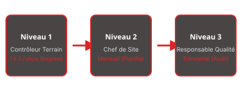

Voici une présentation reformatée en utilisant le Markdown pour Marp, conformément à vos instructions :

---
marp: true
theme: gss
size: a4
paginate: true
---

<!-- _class: lead -->
# MÉMOIRE TECHNIQUE
## GSS Sécurité 
### VOTRE PARTENAIRE SÉCURITÉ

---

<!-- _class: intercalaire -->
# SOMMAIRE

- Présentation de notre structure
- Les moyens humains
- Les moyens opérationnels
- Les moyens organisationnels
- Les procédures opérationnelles
- Engagement écologique
- Références

---

<!-- _class: intercalaire -->
# I. PRÉSENTATION DE LA SOCIÉTÉ GSS

## Notre expertise

Global Security Services (GSS) est un acteur incontournable dans la **sécurité privée**, spécialisé en sécurité incendie et sûreté lors d'événements importants. 

- **Agents formés et certifiés** : SSIAP et CQP
- **Flexibilité d'effectifs** selon les besoins
- **Gestion proactive des flux de personnes**

---

## Notre approche

1. **Analyse approfondie des risques**  
    Identification des potentiels incidents.

2. **Mobilisation rapide d'effectifs qualifiés**  
    Flotte de véhicules adaptés et géolocalisés.

3. **Formation continue** de nos agents  
    Sessions régulières et recyclage.

---

<!-- _class: intercalaire -->
# II. LES MOYENS HUMAINS

## Ajustement avec le besoin

- **Agents spécialisés** : APS, cynophiles, SSIAP.
- **Adaptation rapide** à l'évolution des besoins d'événements.

---

## Formations et qualifications

- **Certification** : CQP, SSIAP.
- **Formations internes** régulières pour mise à jour des compétences.

---

<!-- _class: intercalaire -->
# III. LES MOYENS OPÉRATIONNELS

## Tenues et matériels

- **Uniformes réglementaires**, visibles et identifiables.
- **Équipements** : Talkies-walkies, PTI, DATI pour la sécurité des agents.

---

## Système de contrôle des rondes

1. **Main courante électronique** : Suivi des agents en temps réel.
2. **Contrôles de rondes** effectués avec précision.  
   

---

<!-- _class: intercalaire -->
# IV. LES MOYENS ORGANISATIONNELS

## Suivi qualité

1. **Contrôles inopinés** : Vérifications entre 1 et 3 fois par mois.
2. **Évaluations mensuelles** : Qualité et procédures.
3. **Bilan trimestriel** : Améliorations continues.

---

## Outils de suivi

- **Trackforce** : logiciel de gestion des rondes et des incidents.
- **Reporting** : Rapports détaillés transmis au client.

---

<!-- _class: intercalaire -->
# V. ENGAGEMENT ÉCOLOGIQUE

## Nos actions

1. **Transports écologiques** : 
   - Promotion du covoiturage
   - Remplacement par une flotte électrique.  
   

2. **Utilisation numérique** : 
   - Réduction du papier
   - Sensibilisation à l’écoresponsabilité.

---

3. **Économies d'énergie** : 
   - Optimisation de l'éclairage 
   - Entretien régulier des véhicules.

---

<!-- _class: intercalaire -->
# VI. RÉFÉRENCES

## Ils nous ont fait confiance

- **Evénements passés** : 
  - Parc des Expositions de Rouen
  - Événements de grande affluence

---

## Contactez GSS

Pour toute demande complémentaire d'information ou de devis, n'hésitez pas à nous contacter à [notre adresse email](mailto:contact@gss-securite.com).

---

Cette présentation offre un format clair et aéré, respectant le contenu fourni tout en structurant les informations de manière professionnelle.