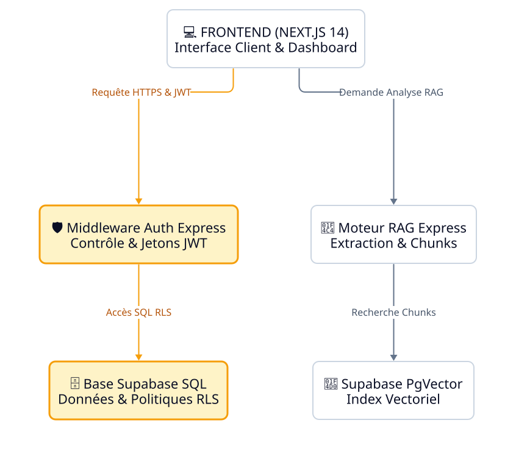

<!-- _class: lead -->

# Mémoire Technique GSS

## Offre de Services de Sécurité

---

<!-- _class: intercalaire -->

# I. Présentation de la Structure

---

# I. Présentation de la Structure

## 1. Notre Catalogue de Prestations

GSS Sécurité propose une gamme complète de prestations pour garantir la sûreté et la sécurité de vos biens et personnes :

* **Surveillance humaine** : Agents de sécurité qualifiés pour la gestion des accès, le contrôle des flux et la prévention des risques.
* **Sécurité événementielle** : Dispositifs adaptés pour les manifestations culturelles, sportives et corporatives.
* **Sécurité mobile & Ronde** : Patrouilles aléatoires ou planifiées pour inspecter vos locaux en dehors des heures d'ouverture.

Nos agents sont formés en continu aux dernières techniques de prévention et de secours (SST, SSIAP 1/2/3).

---

<!-- _class: intercalaire -->

# II. Architecture de la Plateforme

---

# II. Architecture de la Plateforme

## 1. Topologie Technique et Flux Sécurisés

La plateforme s'appuie sur une architecture de dernière génération assurant des transferts chiffrés et une résilience maximale.

  

⚠️ L'architecture suit un modèle strict de ségrégation des droits (RLS) pour garantir la confidentialité des données (Points orange = sécurité).

